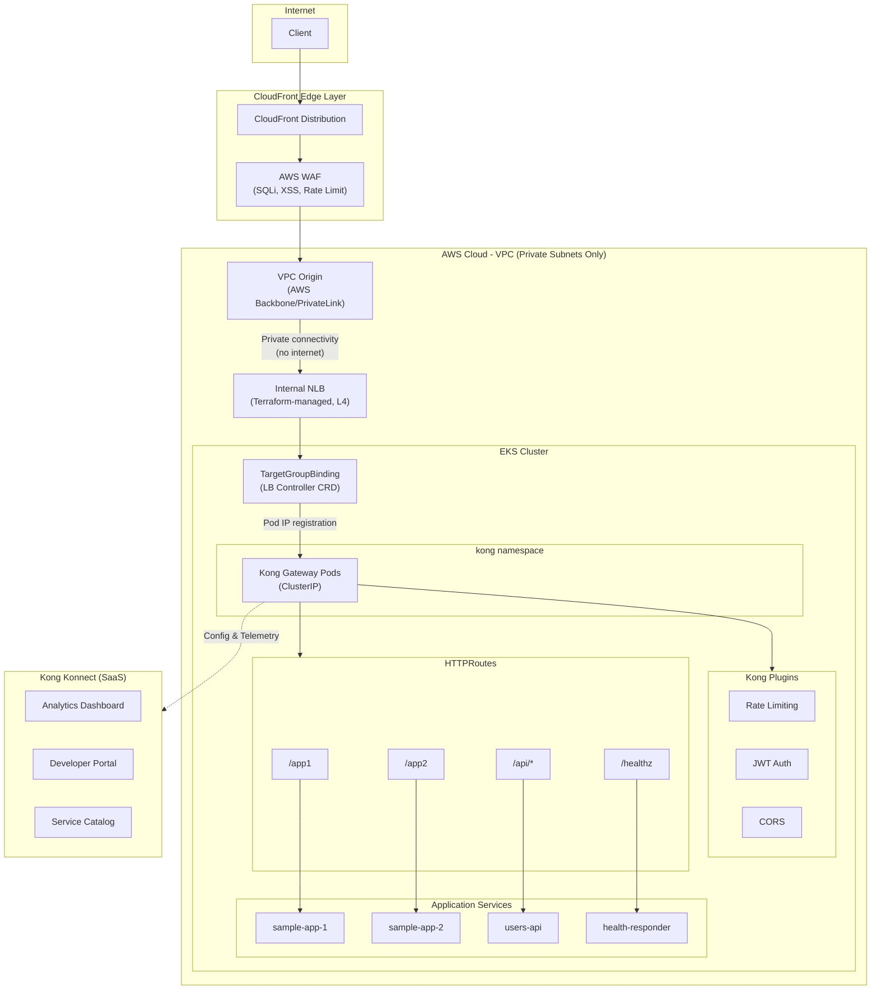
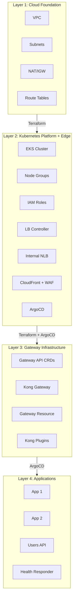
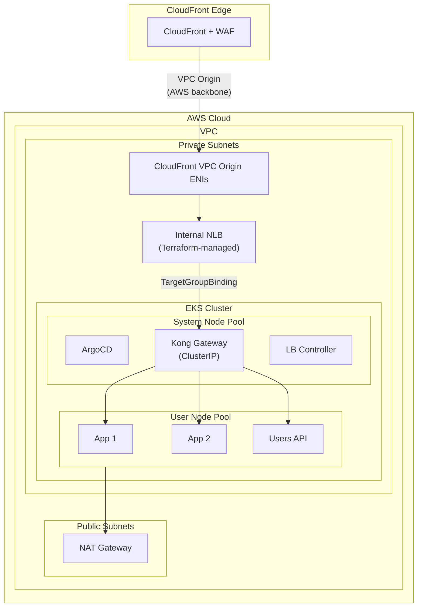
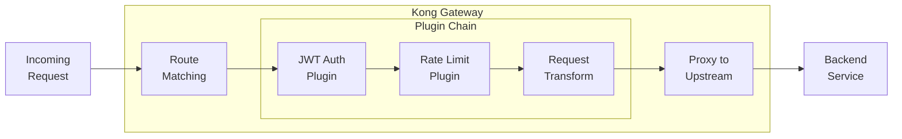
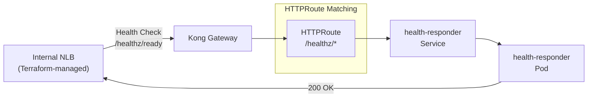

# POC - AWS EKS with Kubernetes Gateway API & Kong Gateway

**Author:** Shanaka Jayasundera - shanakaj@gmail.com

This POC demonstrates how to implement Kubernetes Gateway API on AWS EKS with Kong Gateway, with optional integration to Kong Konnect for API management capabilities.

While my previous posts used Istio as the Gateway API implementation, Kong Gateway offers a different approach—focusing on API gateway capabilities at the edge without the service mesh complexity.

This is particularly relevant for teams who:
- Need API management features (rate limiting, authentication, developer portal) without a full service mesh
- Want a simpler operational model (no sidecars)
- Are already using or evaluating Kong for API management
- Need to expose both APIs and web applications through the same gateway

## Kong Gateway vs Istio: When to Use Which?

| Aspect | Kong Gateway | Istio |
|--------|--------------|-------|
| **Primary Focus** | API Gateway (North-South) | Service Mesh (East-West + North-South) |
| **Architecture** | Edge proxy only | Sidecar or Ambient mesh |
| **API Management** | Built-in (auth, rate limiting, portal) | Limited |
| **Service-to-Service mTLS** | Requires Kong Mesh | Built-in |
| **Operational Complexity** | Lower | Higher |
| **Resource Overhead** | Lower (edge only) | Higher (sidecars/ztunnel) |
| **Best For** | API-first, external consumers | Microservices security, observability |

**Choose Kong Gateway when:** You need strong API management at the edge, have external API consumers, want simpler operations, or don't need service mesh features.

**Choose Istio when:** You need service-to-service mTLS, internal traffic policies, or full mesh observability.

**You can use both together:** Kong at the edge for API management, Istio Ambient internally for service mesh.

## Architecture Overview



| Component | Purpose |
|-----------|---------|
| CloudFront + WAF | Edge security (DDoS, SQLi, XSS, rate limiting), TLS termination |
| VPC Origin | Private connectivity from CloudFront to VPC via AWS backbone (PrivateLink) |
| Internal NLB | Terraform-managed L4 load balancer in private subnets (no public IP) |
| TargetGroupBinding | CRD that registers Kong pod IPs with NLB target group |
| Kong Gateway | Kubernetes Gateway API implementation with API management plugins |
| KongPlugins | Authentication, rate limiting, transformation |
| HTTPRoutes | Per-namespace routing rules for tenants (K8s Gateway API) |
| Kong Konnect | Analytics, developer portal, management UI (SaaS) |

**Key security property:** The NLB has no public endpoint. CloudFront VPC Origin connects via AWS-managed ENIs in private subnets. **It is impossible to bypass CloudFront.**

## Architecture Layers



| Layer | Tool | What It Creates |
|-------|------|-----------------|
| **Layer 1** | Terraform | VPC, Subnets (Public/Private), NAT/IGW, Route Tables |
| **Layer 2** | Terraform | EKS, Node Groups, IAM (IRSA), LB Controller, Internal NLB, CloudFront + WAF + VPC Origin, ArgoCD |
| **Layer 3** | ArgoCD | Gateway API CRDs, Kong Gateway (ClusterIP), Gateway, HTTPRoutes |
| **Layer 4** | ArgoCD | Applications (app1, app2, users-api, health-responder) |

## EKS Cluster Architecture



| Node Pool | Taint | Workloads |
|-----------|-------|-----------|
| System Nodes | CriticalAddonsOnly | ArgoCD, Kong components, AWS LB Controller |
| User Nodes | None | Application workloads (app1, app2, users-api) |

## Prerequisites

- AWS CLI configured with appropriate credentials
- Terraform >= 1.5
- kubectl
- Helm 3.x
- Kong Konnect account (for management features)

## Deployment Steps

### Step 1: Clone Repository

```bash
git clone https://github.com/shanaka-versent/EKS-Kong-GatewayAPI-Demo.git
cd EKS-Kong-GatewayAPI-Demo
```

### Step 2: Deploy Infrastructure (Layers 1 & 2)

```bash
cd terraform
terraform init

# Deploy without CloudFront (basic setup)
terraform apply

# OR deploy with CloudFront + WAF + VPC Origin (production-ready)
terraform apply -var="enable_cloudfront=true"
```

> **Note:** When `enable_cloudfront=true`, Terraform creates the Internal NLB, CloudFront VPC Origin, and WAF. The VPC Origin can take 15+ minutes to deploy.

### Step 3: Configure kubectl

```bash
$(terraform output -raw eks_get_credentials_command)
```

### Step 4: Configure Kong Konnect Integration

Before deploying Kong Gateway, set up Kong Konnect credentials:

1. Log in to [Kong Konnect](https://cloud.konghq.com)
2. Create a new Control Plane (or use existing)
3. Go to **Data Plane Nodes** → **New Data Plane Node**
4. Copy the cluster endpoint and download certificates

```bash
# Create Kong namespace
kubectl create namespace kong

# Create TLS secret for Konnect connection
kubectl create secret tls konnect-client-tls -n kong \
  --cert=/path/to/tls.crt \
  --key=/path/to/tls.key

# Create cluster certificate secret
kubectl create secret generic konnect-cluster-cert -n kong \
  --from-file=ca.crt=/path/to/ca.crt
```

Update `k8s/kong/konnect-values.yaml` with your Konnect endpoints:
```yaml
gateway:
  env:
    cluster_control_plane: "<your-cp>.us.cp0.konghq.com:443"
    cluster_server_name: "<your-cp>.us.cp0.konghq.com"
    cluster_telemetry_endpoint: "<your-cp>.us.tp0.konghq.com:443"
    cluster_telemetry_server_name: "<your-cp>.us.tp0.konghq.com"
```

### Step 5: Deploy ArgoCD Root App (Layers 3 & 4)

```bash
# Get ArgoCD admin password
terraform output -raw argocd_admin_password

# Apply root application
kubectl apply -f argocd/apps/root-app.yaml

# Wait for all apps to sync
kubectl get applications -n argocd -w
```

### Step 6: Verify Konnect Connection

1. Go to Kong Konnect dashboard
2. Navigate to **Gateway Manager** → Your Control Plane
3. You should see your data plane node connected
4. Analytics will start appearing within minutes

## Kong Konnect Features

| Feature | Description |
|---------|-------------|
| **Analytics Dashboard** | Real-time traffic metrics, latency percentiles, error rates |
| **Service Catalog** | Visual inventory of all your APIs and routes |
| **Developer Portal** | Auto-generated API documentation, try-it-out, API key self-service |
| **Centralized Config** | Manage plugins and routes from UI (syncs to data plane) |
| **Multi-Cluster View** | Manage multiple EKS clusters from single pane |

## Verification

### Test Endpoints

```bash
# When CloudFront is enabled, use the CloudFront URL:
CF_URL=$(cd terraform && terraform output -raw cloudfront_url)

# Test App 1 (no plugins)
curl ${CF_URL}/app1

# Test App 2 (no plugins)
curl ${CF_URL}/app2

# Test Users API (with rate limiting)
curl ${CF_URL}/api/users

# Test health endpoint
curl ${CF_URL}/healthz/ready

# Verify NLB target health (Kong pods should be healthy)
TG_ARN=$(cd terraform && terraform output -raw nlb_target_group_arn)
aws elbv2 describe-target-health --target-group-arn ${TG_ARN}

# Verify TargetGroupBinding
kubectl get targetgroupbindings -n kong
```

### Access ArgoCD UI

```bash
kubectl port-forward svc/argocd-server -n argocd 8080:443
# Open https://localhost:8080
# Username: admin
# Password: terraform output -raw argocd_admin_password
```

## Kong Plugins

This POC demonstrates Kong's API management capabilities:



### Rate Limiting
```yaml
apiVersion: configuration.konghq.com/v1
kind: KongPlugin
metadata:
  name: rate-limiting
config:
  minute: 100
  policy: local
  limit_by: ip
plugin: rate-limiting
```

### JWT Authentication
```yaml
apiVersion: configuration.konghq.com/v1
kind: KongPlugin
metadata:
  name: jwt-auth
config:
  claims_to_verify:
  - exp
plugin: jwt
```

### CORS
```yaml
apiVersion: configuration.konghq.com/v1
kind: KongPlugin
metadata:
  name: cors
config:
  origins: ["*"]
  methods: [GET, POST, PUT, DELETE]
plugin: cors
```

## Why Kong Gateway for API Management?

| Capability | Kong Gateway | Istio |
|------------|--------------|-------|
| **Rate Limiting** | Native plugin, simple config | Requires EnvoyFilter (complex) |
| **JWT/OAuth Auth** | Native plugin | RequestAuthentication + AuthorizationPolicy |
| **API Key Auth** | Native plugin | Not built-in |
| **Request Transform** | Native plugin | EnvoyFilter required |
| **Developer Portal** | Konnect (built-in) | Not available |
| **API Analytics** | Konnect (built-in) | Requires Kiali + Prometheus |
| **100+ Plugins** | Yes | No |

## Critical Fix: Health Probes

NLB health probes require explicit HTTPRoute configuration. The NLB target group health check hits Kong pods on port 8100 (`/healthz/ready`), which is the Kong status endpoint. Additionally, CloudFront origin health checks route through Kong to the health-responder service:



## Cleanup

```bash
# Delete ArgoCD apps first
kubectl delete -f argocd/apps/root-app.yaml

# Wait for resources to be cleaned up
sleep 60

# Destroy infrastructure
cd terraform
terraform destroy
```

## Related Projects

- [EKS Istio Gateway API POC](https://github.com/shanaka-versent/EKS-Istio-GatewayAPI-Demo) - Same architecture with Istio Ambient Mesh
- [AKS Istio Gateway API POC](https://github.com/shanaka-versent/AKS-Istio-GatewayAPI-Demo) - Azure AKS implementation

## Resources

- [Kong Gateway Documentation](https://docs.konghq.com/gateway/latest/)
- [Kong Kubernetes Ingress Controller](https://docs.konghq.com/kubernetes-ingress-controller/latest/)
- [Kong Konnect](https://docs.konghq.com/konnect/)
- [Kubernetes Gateway API Documentation](https://gateway-api.sigs.k8s.io/)
