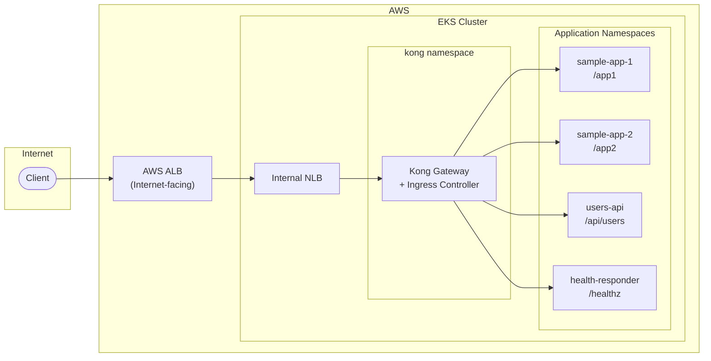
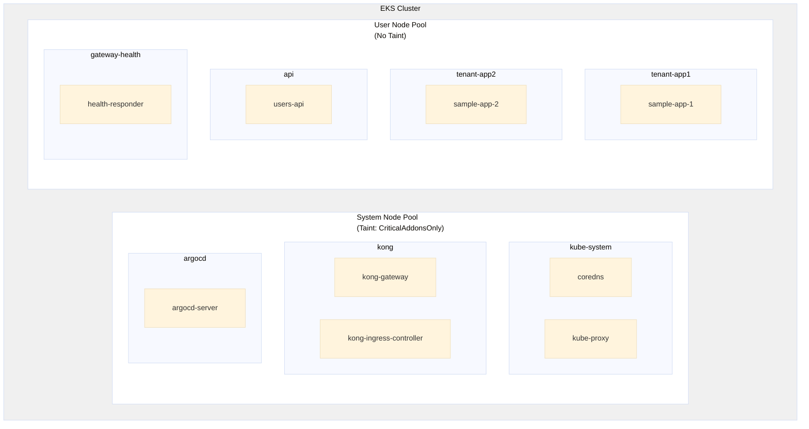
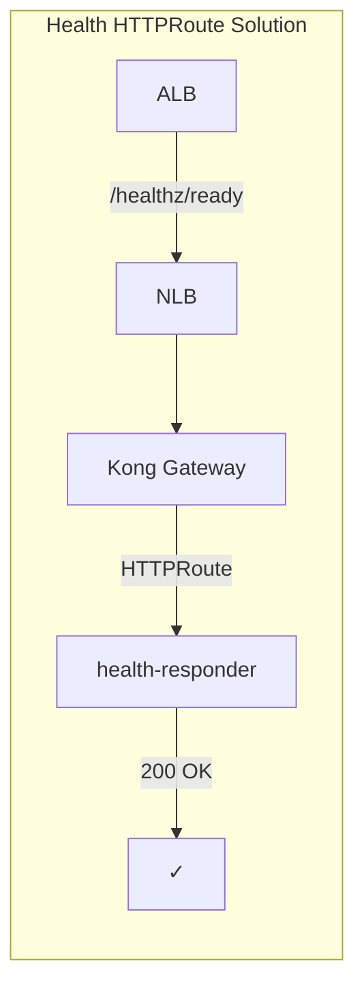

# POC - AWS EKS with Kubernetes Gateway API & Kong Gateway

**Author:** Shanaka Jayasundera - shanakaj@gmail.com

This POC demonstrates how to implement Kubernetes Gateway API on AWS EKS with Kong Gateway, exposed via AWS Application Load Balancer (ALB).

While the Istio implementation uses a service mesh for internal mTLS, Kong Gateway offers a compelling alternative—especially for teams that need **API management capabilities** without the complexity of a full service mesh. Kong provides authentication, rate limiting, request transformation, and analytics out of the box, making it an excellent choice for API-centric workloads.

## Key Features

| Feature | Description |
|---------|-------------|
| **Kubernetes Gateway API** | Future-proof networking replacing deprecated Ingress-NGINX (retiring March 2026) |
| **Kong Gateway** | API gateway with 100+ plugins for auth, rate limiting, transformation |
| **AWS ALB + Internal NLB** | Leverage existing ALB/WAF infrastructure for secure internet exposure |
| **ArgoCD GitOps** | Declarative, version-controlled Kubernetes customisations and deployments |
| **Separated Node Pools** | System nodes for critical add-ons, User nodes for application workloads |
| **Layered Architecture** | Clear separation: Cloud foundations → EKS setup → K8s customisations → Applications |

## Kong Gateway vs Istio

| Aspect | Kong Gateway | Istio |
|--------|--------------|-------|
| **Primary Use Case** | API Gateway + Ingress | Service Mesh + Ingress |
| **Traffic Scope** | North-South (edge) | North-South + East-West |
| **Sidecar Required** | No | Yes (or Ambient mode) |
| **API Management** | Built-in (100+ plugins) | Limited |
| **Resource Overhead** | Lower | Higher |
| **Best For** | API-centric workloads | Microservices with internal mTLS |

## Architecture Overview



## Architecture Layers

| Layer | Tool | What It Creates |
|-------|------|-----------------|
| **Layer 1** | Terraform | VPC, Subnets (Public/Private), NAT/IGW, Route Tables |
| **Layer 2** | Terraform | EKS, Node Groups (System/User), IAM, ArgoCD |
| **Layer 3** | ArgoCD | Gateway API CRDs, Kong Gateway, Gateway, HTTPRoutes |
| **Layer 4** | ArgoCD | Applications (app1, app2, users-api), KongPlugins |

## EKS Cluster Detail



## Prerequisites

- AWS CLI configured with appropriate credentials
- Terraform >= 1.5
- kubectl
- Helm 3
- jq (for post-deployment script)

## Deployment Steps

### Step 1: Clone Repository

```bash
git clone https://github.com/shanaka-versent/EKS-Kong-GatewayAPI-Demo.git
cd EKS-Kong-GatewayAPI-Demo
```

### Step 2: Deploy Infrastructure (Layers 1 & 2)

```bash
cd terraform

# Initialize and apply
terraform init
terraform apply
```

This creates:
- **Layer 1:** VPC, subnets, NAT gateway
- **Layer 2:** EKS cluster, ArgoCD

### Step 3: Configure kubectl

```bash
# Get credentials
$(terraform output -raw eks_get_credentials_command)
```

### Step 4: Deploy ArgoCD Root App (Layers 3 & 4)

```bash
# Get ArgoCD admin password
terraform output -raw argocd_admin_password

# Apply root application
kubectl apply -f argocd/apps/root-app.yaml

# Wait for all apps to sync
kubectl get applications -n argocd -w
```

This deploys via ArgoCD:
- **Layer 3:** Gateway API CRDs, Kong Gateway, Gateway, HTTPRoutes
- **Layer 4:** Sample apps with Kong plugins

## Verification

### Test Endpoints

```bash
# Get Kong Gateway LoadBalancer IP
KONG_LB=$(kubectl get svc -n kong kong-kong-proxy -o jsonpath='{.status.loadBalancer.ingress[0].hostname}')

# Test App 1 (no plugins)
curl http://${KONG_LB}/app1

# Test App 2 (no plugins)
curl http://${KONG_LB}/app2

# Test Users API (with rate limiting)
curl http://${KONG_LB}/api/users

# Test health endpoint
curl http://${KONG_LB}/healthz/ready
```

### Access ArgoCD UI

```bash
# Port forward to ArgoCD
kubectl port-forward svc/argocd-server -n argocd 8080:443

# Open https://localhost:8080
# Username: admin
# Password: terraform output -raw argocd_admin_password
```

### Check ArgoCD Apps

```bash
kubectl get applications -n argocd
```

Expected output:
```
NAME                SYNC STATUS   HEALTH STATUS
gateway-api-crds    Synced        Healthy
kong-gateway        Synced        Healthy
gateway-config      Synced        Healthy
gateway-health      Synced        Healthy
tenant-app1         Synced        Healthy
tenant-app2         Synced        Healthy
users-api           Synced        Healthy
```

## Kong Plugins

This POC demonstrates Kong's API management capabilities:

### Rate Limiting
```yaml
apiVersion: configuration.konghq.com/v1
kind: KongPlugin
metadata:
  name: rate-limiting
config:
  minute: 100
  policy: local
  limit_by: ip
plugin: rate-limiting
```

### Request Transformer
```yaml
apiVersion: configuration.konghq.com/v1
kind: KongPlugin
metadata:
  name: request-transformer
config:
  add:
    headers:
      - "X-Request-ID:$(uuid)"
plugin: request-transformer
```

### CORS
```yaml
apiVersion: configuration.konghq.com/v1
kind: KongPlugin
metadata:
  name: cors
config:
  origins: ["*"]
  methods: [GET, POST, PUT, DELETE]
plugin: cors
```

## Critical Fix: Health Probes

Just like the Istio implementation, ALB health probes require explicit HTTPRoute configuration:



Without the health HTTPRoute, ALB health checks would fail with 404.

## Cleanup

```bash
# Delete ArgoCD apps first
kubectl delete -f argocd/apps/root-app.yaml

# Wait for resources to be cleaned up
sleep 60

# Destroy infrastructure
cd terraform
terraform destroy
```

## Cloud Provider Comparison

| Component | Azure (AKS) | AWS (EKS) |
|-----------|-------------|-----------|
| External L7 LB | Azure App Gateway | AWS ALB |
| Internal L4 LB | Azure Internal LB | AWS Internal NLB |
| Gateway Implementation | Kong Gateway | Kong Gateway |
| Gateway API | Same (K8s standard) | Same (K8s standard) |
| GitOps | ArgoCD | ArgoCD |

## Related Projects

- [EKS Istio Gateway API POC](https://github.com/shanaka-versent/EKS-Istio-GatewayAPI-Demo) - Same architecture with Istio Ambient Mesh
- [AKS Istio Gateway API POC](https://github.com/shanaka-versent/AKS-Istio-GatewayAPI-Demo) - Azure AKS implementation

## Resources

- [Kong Gateway Documentation](https://docs.konghq.com/gateway/latest/)
- [Kong Gateway API Support](https://docs.konghq.com/kubernetes-ingress-controller/latest/concepts/gateway-api/)
- [Kubernetes Gateway API Documentation](https://gateway-api.sigs.k8s.io/)
