# AWS EKS with Kong Gateway as a K8s Gateway API Implementation with API Management

This POC demonstrates how to implement the Kubernetes Gateway API on AWS EKS using **Kong Gateway Enterprise**, integrated with **Kong Konnect** for centralized API management, analytics, and developer portal.

My previous POCs implemented the Kubernetes Gateway API using Istio — on both [AWS EKS](https://github.com/shanaka-versent/EKS-Istio-GatewayAPI-Deom/tree/k8s-gateway-api-poc) and [Azure AKS](https://github.com/shanaka-versent/AKS-Istio-GatewayAPI-Demo/tree/k8s-gateway-api-poc). This POC explores Kong Gateway as an alternative Gateway API implementation, and compares what each brings to the table.

Both Istio and Kong implement the **Kubernetes Gateway API** standard for north-south traffic routing into the cluster. The key difference is what each brings beyond basic ingress:

- **Istio Gateway** implements the K8s Gateway API (GatewayClass, Gateway, HTTPRoute) to handle north-south traffic routing. Separately, Istio also provides a service mesh for east-west (service-to-service) traffic — but using Istio as a Gateway API implementation does not require enabling mesh features.
- **Kong Gateway** implements the same K8s Gateway API standard, but additionally provides **full API management capabilities** built into the gateway itself — rate limiting, authentication (JWT, OAuth, OIDC), request transformations, a developer portal, and 200+ plugins. When connected to **Kong Konnect**, it adds centralized analytics, a developer portal, and SaaS-based management.

In short: Istio Gateway gives you K8s Gateway API routing. Kong Gateway gives you K8s Gateway API routing **plus** API management — without needing a separate API gateway service.

> **Licensing:** This project uses **Kong Gateway Enterprise** (`kong/kong-gateway` image) with licensing automatically managed by Kong Konnect. A [free trial](https://konghq.com/products/kong-konnect/register) gives you 30 days of full Enterprise functionality. An [OSS alternative](#alternative-kong-gateway-oss-without-konnect) is available if you don't have a Konnect subscription.

This is particularly relevant for teams who:
- Need full API management (rate limiting, authentication, developer portal) built into the K8s Gateway API implementation — not as a separate service
- Want a single component that handles both ingress routing and API gateway concerns
- Are already using or evaluating Kong for API management
- Need to expose both APIs and web applications through the same gateway

---

## High-level Architecture

All implementations in this series follow a common reference architecture. The pattern is **cloud-agnostic** and applies to both AWS (CloudFront) and Azure (Front Door).

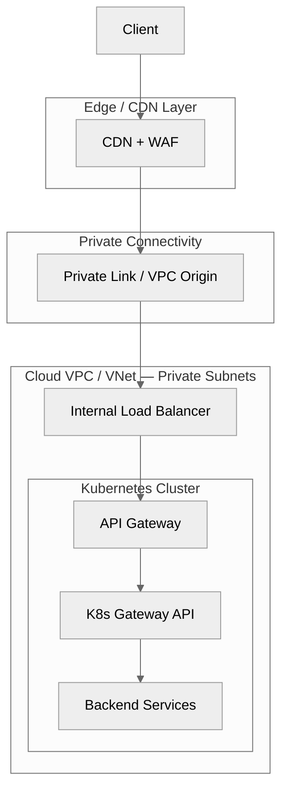

| Layer | Responsibility | Cloud Agnostic |
|-------|---------------|----------------|
| **CDN + WAF** | DDoS protection, geo-blocking, TLS termination, WAF rules (SQLi, XSS, rate limiting) | AWS CloudFront / Azure Front Door |
| **Private Connectivity** | End-to-end private path from edge to VPC — no public endpoints | AWS VPC Origin / Azure Private Link |
| **Internal Load Balancer** | L4 load balancing in private subnets, health checks | AWS NLB / Azure Internal LB |
| **API Gateway Capability** | Auth, rate limiting, request transforms, API key management | Kong, AWS API GW, or built into K8s GW |
| **K8s Gateway API** | Path-based routing via HTTPRoute CRDs, namespace isolation | Kong GatewayClass, Istio GatewayClass |
| **Backend Services** | Application workloads (APIs, web apps, microservices) | K8s Deployments + Services |

> **Key Security Property:** The Internal Load Balancer has NO public endpoint. Private connectivity from the CDN uses AWS-managed ENIs (VPC Origin) or Azure Private Endpoints. **It is impossible to bypass the CDN/WAF layer.**

### Where Does the API Gateway Capability Sit?

The Kubernetes Gateway API standard (GatewayClass, Gateway, HTTPRoute) handles **routing only** — it defines how traffic enters the cluster and reaches backend services. It does **not** provide API management capabilities like authentication, rate limiting, request transformation, or a developer portal.

This means the architectural decision is: **where does API management live?**

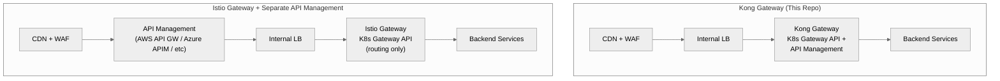

**Kong Gateway** combines K8s Gateway API routing and API management in a single component — rate limiting, auth, transforms, and 200+ plugins are applied directly at the gateway.

**Istio Gateway** implements K8s Gateway API for routing but does not include API management. To expose APIs with full management capabilities (rate limiting, API keys, OAuth, usage plans, developer portal), you need a **separate API management layer** such as:
- **AWS API Gateway** (with VPC Link)
- **Azure API Management (APIM)**
- **Apigee**, **Tyk**, or any other API management platform

This adds an extra component to the architecture, separate traffic paths (API vs web), and additional operational overhead.

---

## Detailed Architecture

Kong Gateway serves as BOTH the API Gateway and the Kubernetes Gateway API implementation. All traffic (web + API) flows through a single path.

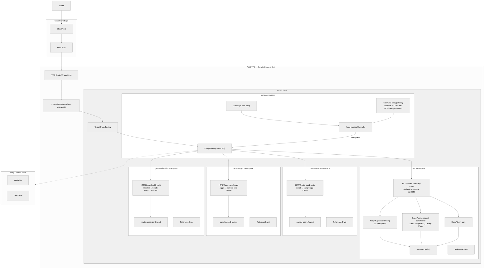

**Traffic Flow:**
```
Client → CloudFront + WAF (TLS) → VPC Origin → Internal NLB → Kong Gateway (TLS) → HTTPRoute → Backend Service
```

**Key Design Decisions:**
- **Single traffic path** — all requests (web + API) flow through Kong Gateway, no split paths
- **Namespace isolation** — each tenant and the API have their own namespace with ReferenceGrant for cross-namespace routing
- **Plugins per-route** — only `/api/users` has rate limiting, request transforms, and CORS; tenant apps are clean pass-through
- **Terraform-managed NLB** — created before Kong deploys (avoids chicken-and-egg with CloudFront VPC Origin)
- **Kong Konnect** — telemetry and management via SaaS, no admin API exposed in-cluster

---

## End-to-End Traffic Flow

The architecture implements **dual TLS termination** for end-to-end encryption, with fully private internal connectivity via VPC Origin (PrivateLink). No public endpoints are exposed inside the VPC.

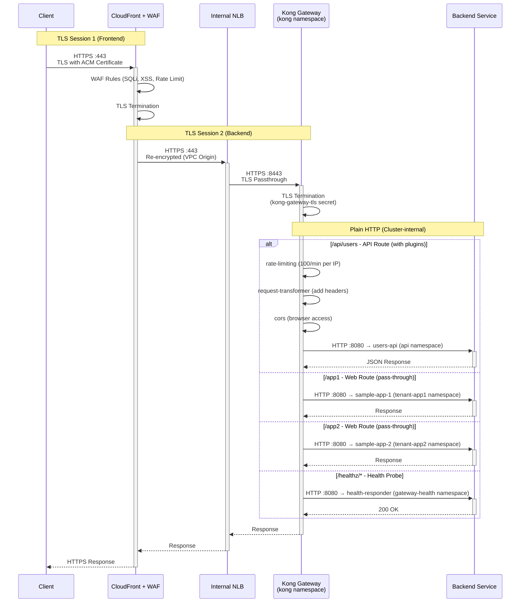

### TLS Certificate Chain

| Component | Certificate | Purpose |
|-----------|-------------|---------|
| **CloudFront Frontend** | ACM Certificate | Terminates client HTTPS, provides trusted public certificate |
| **Kong Gateway Backend** | `kong-gateway-tls` Secret | Terminates re-encrypted traffic from CloudFront via NLB |
| **Kong → Backend Pods** | Plain HTTP | Cluster-internal traffic on port 8080 |

### How It Maps to This Repo

| Component | K8s Resource | File | Details |
|-----------|-------------|------|---------|
| **GatewayClass** | `kong` | `k8s/kong/gateway-class.yaml` | `controllerName: konghq.com/kic-gateway-controller` |
| **Gateway** | `kong-gateway` | `k8s/kong/gateway.yaml` | Listener on port 443 (HTTPS), TLS terminated with `kong-gateway-tls` secret, `allowedRoutes: All` |
| **HTTPRoute** | `users-api-route` | `k8s/apps/api/httproute.yaml` | `/api/users` → `users-api:8080` + plugins: rate-limiting, request-transformer, cors |
| **HTTPRoute** | `app1-route` | `k8s/apps/tenant-app1/httproute.yaml` | `/app1` → `sample-app-1:8080` (no plugins — clean pass-through) |
| **HTTPRoute** | `app2-route` | `k8s/apps/tenant-app2/httproute.yaml` | `/app2` → `sample-app-2:8080` (no plugins — clean pass-through) |
| **HTTPRoute** | `health-route` | `k8s/gateway-health/httproute.yaml` | `/healthz` → `health-responder:8080` (NLB health probes) |
| **KongPlugin** | `rate-limiting` | `k8s/apps/api/kong-plugins.yaml` | 100 req/min per IP, local policy |
| **KongPlugin** | `request-transformer` | `k8s/apps/api/kong-plugins.yaml` | Adds `X-Request-ID`, `X-Forwarded-Proto`, `X-Kong-Proxy` headers |
| **KongPlugin** | `cors` | `k8s/apps/api/kong-plugins.yaml` | All origins, standard methods, exposes rate-limit headers |
| **ReferenceGrant** | Per namespace | Each `httproute.yaml` | Allows cross-namespace routing from app namespaces to `kong` Gateway |
| **NLB** | Terraform-managed | `terraform/modules/nlb/` | Internal NLB with CloudFront prefix list SG; Kong pods registered via TargetGroupBinding |
| **VPC Origin** | Terraform-managed | `terraform/modules/cloudfront/` | PrivateLink from CloudFront to Internal NLB — no public endpoints |

### Traffic Security Layers

| Segment | Security | Details |
|---------|----------|---------|
| **Client → CloudFront** | TLS (ACM Certificate) | HTTPS terminated at edge; trusted public certificate via AWS Certificate Manager |
| **CloudFront WAF** | AWS WAF Managed Rules | SQLi, XSS, bad inputs, rate limiting applied before traffic enters VPC |
| **CloudFront → NLB** | HTTPS via VPC Origin (PrivateLink) | Re-encrypted traffic over AWS backbone — no internet exposure, no public NLB |
| **NLB → Kong Gateway** | TLS Passthrough | NLB forwards HTTPS :443 to Kong :8443; SG allows only CloudFront prefix list |
| **Kong Gateway** | TLS Termination + Plugin Chain | TLS terminated with `kong-gateway-tls` secret; rate limiting, transforms, CORS per-route |
| **Kong → Backend** | Cluster-internal HTTP | HTTPRoute + ReferenceGrant for cross-namespace routing to services on port 8080 |

---

## How Kong Implements the Kubernetes Gateway API

Kong Gateway implements the Kubernetes Gateway API **exactly like Istio does**. The architecture is directly comparable:

| Component | Istio | Kong |
|-----------|-------|------|
| **Controller** (watches Gateway API resources) | Istiod | Kong Ingress Controller (KIC) |
| **Data Plane** (processes traffic) | Envoy Proxy | Kong Gateway |
| **GatewayClass controllerName** | `gateway.istio.io/gateway-controller` | `konghq.com/kic-gateway-controller` |

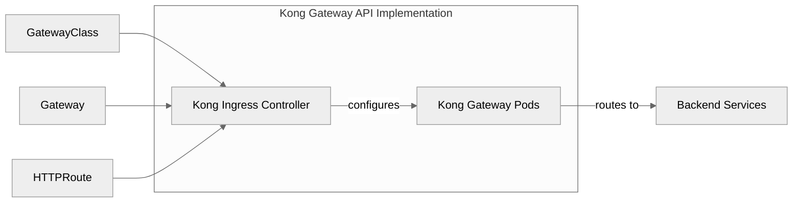

**Key resources in this project:**
- **GatewayClass** (`k8s/kong/gateway-class.yaml`): Registers Kong as the Gateway API implementation
- **Gateway** (`k8s/kong/gateway.yaml`): Creates the Kong Gateway instance listening on ports 80/443
- **HTTPRoute** resources (`k8s/apps/*/httproute.yaml`): Define path-based routing rules

> **Note:** This is the same Gateway API standard. If you've used Istio's Gateway API implementation, switching to Kong only requires changing the `gatewayClassName` — the HTTPRoute resources remain identical.

---

## Why Kong Gateway Over Istio Gateway for API Management?

Both Kong and Istio implement the same Kubernetes Gateway API standard — the HTTPRoute resources are identical. The difference is what each brings beyond routing:

| Capability | Kong Gateway | Istio Gateway |
|-----------|--------------|---------------|
| **K8s Gateway API Routing** | Yes | Yes |
| **Rate Limiting** | Built-in (KongPlugin) | Requires separate API management layer |
| **Authentication (JWT, OAuth, OIDC)** | Built-in (KongPlugin) | Requires separate API management layer |
| **Request/Response Transforms** | Built-in (KongPlugin) | Requires separate API management layer |
| **API Key Management** | Built-in (KongPlugin) | Requires separate API management layer |
| **Developer Portal** | Kong Konnect (SaaS) | Requires separate API management layer |
| **Analytics & Monitoring** | Kong Konnect (SaaS) | Requires separate API management layer |
| **Plugin Ecosystem** | 200+ plugins | N/A |
| **Service Mesh (East-West mTLS)** | Requires Kong Mesh (separate) | Built-in (Ambient or Sidecar) |

Since Istio Gateway only provides ingress routing, teams that need to expose APIs with full management capabilities must add a **separate API management layer** — such as AWS API Gateway, Azure APIM, Apigee, or Tyk. This introduces additional components, split traffic paths, and operational overhead.

Kong Gateway eliminates this by combining K8s Gateway API routing and API management in a single component.

> **Note:** API management (north-south) and service mesh (east-west) are complementary concerns. You can use Kong Gateway at the edge for API management and Istio Ambient internally for service-to-service mTLS — they work together.

---

## Architecture Layers

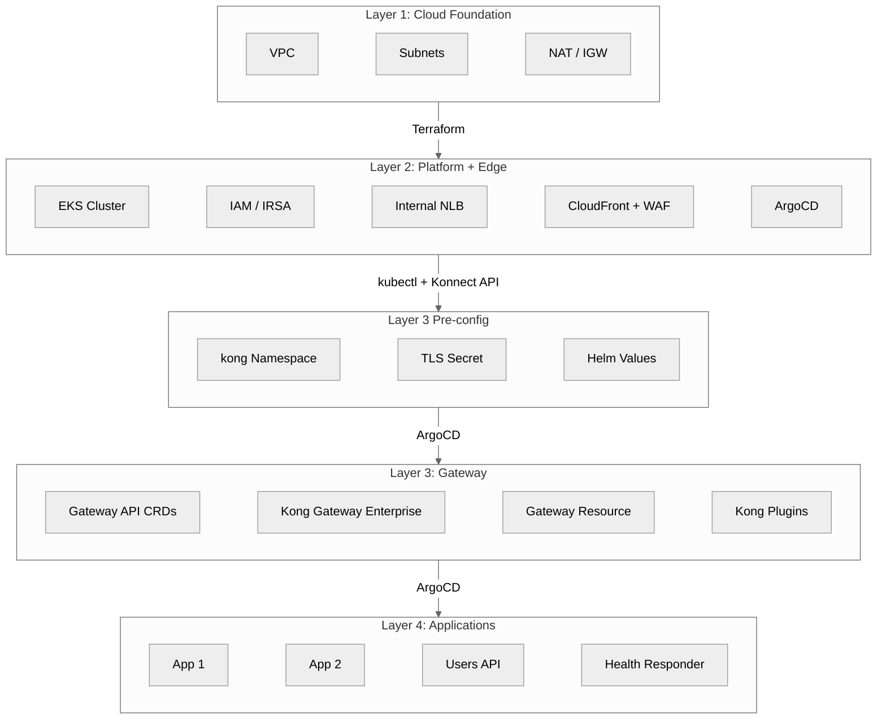

| Layer | Tool | What It Creates |
|-------|------|-----------------|
| **Layer 1** | Terraform | VPC, Subnets (Public/Private), NAT/IGW, Route Tables |
| **Layer 2** | Terraform | EKS, Node Groups, IAM (IRSA), LB Controller, Internal NLB, CloudFront + WAF + VPC Origin, ArgoCD |
| **Layer 3 Pre-config** | kubectl + Konnect API | kong namespace, konnect-client-tls secret, Helm values with Konnect endpoints |
| **Layer 3** | ArgoCD | Gateway API CRDs, Kong Gateway Enterprise (ClusterIP), Gateway, HTTPRoutes, Kong Plugins |
| **Layer 4** | ArgoCD | Applications (app1, app2, users-api, health-responder) |

---

## EKS Cluster Architecture

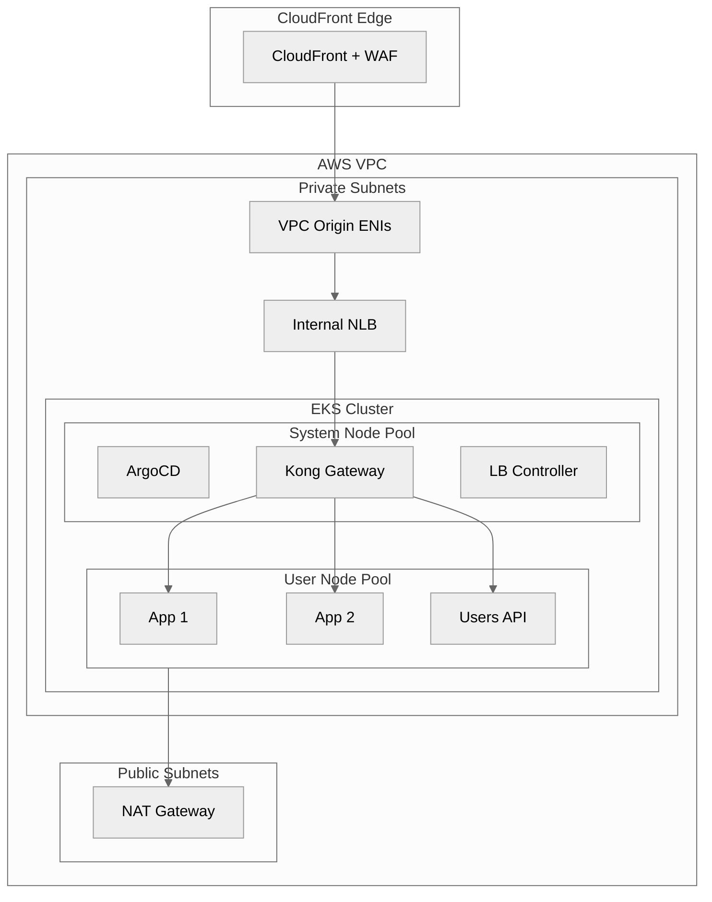

| Node Pool | Taint | Workloads |
|-----------|-------|-----------|
| System Nodes | CriticalAddonsOnly | ArgoCD, Kong components, AWS LB Controller |
| User Nodes | None | Application workloads (app1, app2, users-api) |

---

## Defense in Depth

Security is applied at every layer. WAF handles infrastructure threats at the edge, Kong plugins handle application/API concerns inside the cluster.

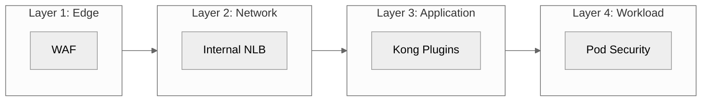

| Layer | What | Example Threats Blocked |
|-------|------|------------------------|
| **Edge (WAF)** | AWS Managed Rules | SQL injection, XSS, known bad inputs, bot floods |
| **Network (NLB)** | Security Groups | Direct access bypass, unauthorized CIDR ranges |
| **Application (Kong)** | Plugins | Unauthenticated API calls, excessive per-consumer requests |
| **Workload (K8s)** | Pod Security | Container escape, privilege escalation, resource abuse |

---

## Kong Plugin Chain

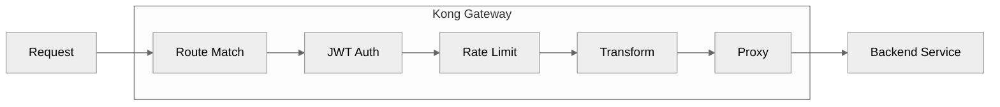

### Rate Limiting
```yaml
apiVersion: configuration.konghq.com/v1
kind: KongPlugin
metadata:
  name: rate-limiting
config:
  minute: 100
  policy: local
  limit_by: ip
plugin: rate-limiting
```

### JWT Authentication
```yaml
apiVersion: configuration.konghq.com/v1
kind: KongPlugin
metadata:
  name: jwt-auth
config:
  claims_to_verify:
  - exp
plugin: jwt
```

### CORS
```yaml
apiVersion: configuration.konghq.com/v1
kind: KongPlugin
metadata:
  name: cors
config:
  origins: ["*"]
  methods: [GET, POST, PUT, DELETE]
plugin: cors
```

---

## Health Check Flow

NLB health probes target Kong's status endpoint directly. Application health checks route through Kong to the health-responder service:

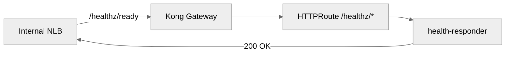

---

## Kong Gateway Editions & Licensing

Kong Gateway comes in two editions. This project defaults to Enterprise via Konnect:

| | Kong Gateway Enterprise (Default) | Kong Gateway OSS (Alternative) |
|---|---|---|
| **Docker Image** | `kong/kong-gateway` | `kong/kong` |
| **License** | Automatically managed by Konnect | No license needed |
| **Enterprise Plugins** | OpenID Connect, OAuth2 Introspection, mTLS, Vault, OPA, etc. | Not available |
| **Analytics** | Konnect Observability (real-time dashboards) | Self-managed (Prometheus/Grafana) |
| **Developer Portal** | Built-in via Konnect | Not available |
| **Admin UI** | Kong Manager + Konnect Dashboard | Kong Manager (limited) |
| **Gateway API Support** | Full (GatewayClass, Gateway, HTTPRoute) | Full (GatewayClass, Gateway, HTTPRoute) |
| **Cost** | Free trial (30 days) → Plus or Enterprise tier | Free forever |

> **Recommendation:** Start with the [Konnect free trial](https://konghq.com/products/kong-konnect/register) to get Enterprise features with zero license management. See the [OSS alternative](#alternative-kong-gateway-oss-without-konnect) section if you prefer to run without Konnect.

---

## Prerequisites

- AWS CLI configured with appropriate credentials
- Terraform >= 1.5
- kubectl
- Helm 3.x
- Kong Konnect account ([free trial](https://konghq.com/products/kong-konnect/register) or paid subscription)

## Deployment Steps

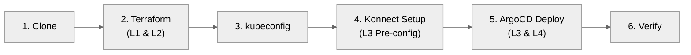

### Step 1: Clone Repository

```bash
git clone https://github.com/shanaka-versent/EKS-Kong-GatewayAPI-Demo.git
cd EKS-Kong-GatewayAPI-Demo
```

### Step 2: Deploy Infrastructure (Layers 1 & 2)

```bash
cd terraform
terraform init

# Deploy without CloudFront (basic setup)
terraform apply

# OR deploy with CloudFront + WAF + VPC Origin (production-ready)
terraform apply -var="enable_cloudfront=true"
```

> **Note:** When `enable_cloudfront=true`, Terraform creates the Internal NLB, CloudFront VPC Origin, and WAF. The VPC Origin can take 15+ minutes to deploy.

### Step 3: Configure kubectl

```bash
$(terraform output -raw eks_get_credentials_command)
```

### Step 4: Configure Kong Konnect Integration (Layer 3 Pre-config)

This step **must be completed before Step 5** (ArgoCD deployment). ArgoCD will deploy Kong Gateway Enterprise in Layer 3, and the Enterprise pods require:
- The `kong` namespace with `konnect-client-tls` secret (Konnect mTLS) and `kong-gateway-tls` secret (end-to-end TLS)
- Helm values configured with the Konnect endpoints and Enterprise image
- The mTLS certificate registered with your Konnect Control Plane

Konnect automatically provisions the Enterprise license — no license file management required.

> **Don't have a Konnect account?** See the [OSS alternative](#alternative-kong-gateway-oss-without-konnect) to deploy without Konnect.

1. **Create a Control Plane in Konnect**
   - Sign in to [cloud.konghq.com](https://cloud.konghq.com)
   - In the left sidebar, click **API Gateway**
   - Click **+ New Control Plane** → choose **Kong Ingress Controller**
   - Name it (e.g., `eks-demo`) and save
   - Note the **Control Plane ID** from the overview page

2. **Generate Konnect mTLS Certificates**
   ```bash
   openssl req -new -x509 -nodes -newkey rsa:2048 \
     -subj "/CN=kongdp/C=US" \
     -keyout ./tls.key -out ./tls.crt -days 365
   ```

3. **Generate Gateway TLS Certificates (End-to-End TLS)**
   ```bash
   ./scripts/01-generate-certs.sh
   ```

4. **Create TLS Secrets in Kubernetes**
   ```bash
   kubectl create namespace kong

   # Konnect mTLS secret
   kubectl create secret tls konnect-client-tls -n kong \
     --cert=./tls.crt \
     --key=./tls.key

   # Gateway TLS secret (for end-to-end encryption)
   kubectl create secret tls kong-gateway-tls -n kong \
     --cert=certs/server.crt \
     --key=certs/server.key
   ```

5. **Register Certificate with Konnect**
   ```bash
   # Set your Konnect variables
   export KONNECT_REGION="us"          # us, eu, au, me, in, sg
   export KONNECT_TOKEN="kpat_xxx..."  # Personal access token from Konnect
   export CONTROL_PLANE_ID="your-cp-id-here"

   # Format certificate for API (remove newlines)
   CERT=$(awk 'NF {sub(/\r/, ""); printf "%s\\n",$0;}' tls.crt)

   # Register the certificate with Konnect
   curl -X POST "https://${KONNECT_REGION}.api.konghq.com/v2/control-planes/${CONTROL_PLANE_ID}/dp-client-certificates" \
     -H "Authorization: Bearer $KONNECT_TOKEN" \
     --json "{\"cert\": \"$CERT\"}"
   ```

6. **Update Helm Values**

   Update `k8s/kong/konnect-values.yaml` with your Konnect endpoints:
   ```yaml
   image:
     repository: kong/kong-gateway   # Enterprise image (license via Konnect)
     tag: "3.9"

   ingressController:
     enabled: true
     konnect:
       enabled: true
       controlPlaneId: "<your-control-plane-id>"
       tlsClientCertSecretName: konnect-client-tls

   gateway:
     env:
       role: data_plane
       database: "off"
       konnect_mode: "on"
       vitals: "off"
       cluster_mtls: pki
       cluster_control_plane: "<your-cp>.us.cp0.konghq.com:443"
       cluster_server_name: "<your-cp>.us.cp0.konghq.com"
       cluster_telemetry_endpoint: "<your-tp>.us.tp0.konghq.com:443"
       cluster_telemetry_server_name: "<your-tp>.us.tp0.konghq.com"
       cluster_cert: /etc/secrets/konnect-client-tls/tls.crt
       cluster_cert_key: /etc/secrets/konnect-client-tls/tls.key
       lua_ssl_trusted_certificate: system

     secretVolumes:
       - konnect-client-tls
   ```

#### Konnect Configuration Parameters Reference

| Parameter | Description | Example |
|-----------|-------------|---------|
| `cluster_control_plane` | Control plane endpoint (host:port) | `example.us.cp0.konghq.com:443` |
| `cluster_server_name` | SNI for TLS connection to control plane | `example.us.cp0.konghq.com` |
| `cluster_telemetry_endpoint` | Telemetry endpoint for analytics | `example.us.tp0.konghq.com:443` |
| `cluster_telemetry_server_name` | SNI for telemetry TLS connection | `example.us.tp0.konghq.com` |
| `cluster_mtls` | mTLS mode (`pki` for Konnect) | `pki` |
| `cluster_cert` | Path to client certificate | `/etc/secrets/konnect-client-tls/tls.crt` |
| `cluster_cert_key` | Path to client private key | `/etc/secrets/konnect-client-tls/tls.key` |

### Step 5: Deploy Kong Gateway & Applications via ArgoCD (Layers 3 & 4)

ArgoCD now deploys Kong Gateway Enterprise (Layer 3) using the Konnect configuration from Step 4, followed by the application workloads (Layer 4).

```bash
# Get ArgoCD admin password
terraform output -raw argocd_admin_password

# Apply root application — this triggers Layer 3 (Kong Gateway) and Layer 4 (Apps)
kubectl apply -f argocd/apps/root-app.yaml

# Wait for all apps to sync
kubectl get applications -n argocd -w
```

> **What ArgoCD deploys in order:**
> 1. Gateway API CRDs
> 2. Kong Gateway Enterprise (using `konnect-values.yaml` with the Enterprise image and Konnect config)
> 3. GatewayClass + Gateway resources
> 4. Application workloads (app1, app2, users-api, health-responder) with HTTPRoutes

### Step 6: Verify Deployment

#### Verify Gateway API Resources

```bash
# Verify Kong Gateway pods are running
kubectl get pods -n kong

# Check GatewayClass status
kubectl get gatewayclass kong -o yaml

# Check Gateway status
kubectl get gateway kong-gateway -n kong -o yaml

# Verify HTTPRoutes are working
kubectl get httproutes -A
```

#### Verify Konnect Connection

1. **Check Data Plane Status in Konnect UI**
   - Go to Kong Konnect dashboard at [cloud.konghq.com](https://cloud.konghq.com)
   - In the left sidebar, click **API Gateway**
   - Click on your Control Plane to open the Overview dashboard
   - Click **Data Plane Nodes** in the sidebar to see connected nodes
   - Your data plane node(s) should show status **"Connected"**
   - The Enterprise license is automatically applied — no manual license file needed
   
2. **Verify from Kubernetes**
   ```bash
   # Check Kong pod logs for successful Konnect connection
   kubectl logs -n kong -l app.kubernetes.io/name=kong --tail=50 | grep -i konnect

   # Verify pods are running with Enterprise image
   kubectl get pods -n kong -o jsonpath='{.items[0].spec.containers[0].image}'
   # Should show: kong/kong-gateway:3.9

   # Check for any connection errors
   kubectl logs -n kong -l app.kubernetes.io/name=kong | grep -i "error\|failed"
   ```

3. **Verify Enterprise Features**
   - Analytics will start appearing in the Konnect dashboard within 1-2 minutes
   - Enterprise plugins (OpenID Connect, OPA, Vault, etc.) are now available
   - Configuration changes in Konnect UI sync to data planes within seconds

## Testing

### Test Endpoints

```bash
# When CloudFront is enabled, use the CloudFront URL:
CF_URL=$(cd terraform && terraform output -raw cloudfront_url)

# Test App 1 (no plugins)
curl ${CF_URL}/app1

# Test App 2 (no plugins)
curl ${CF_URL}/app2

# Test Users API (with rate limiting)
curl ${CF_URL}/api/users

# Test health endpoint
curl ${CF_URL}/healthz/ready

# Verify NLB target health (Kong pods should be healthy)
TG_ARN=$(cd terraform && terraform output -raw nlb_target_group_arn)
aws elbv2 describe-target-health --target-group-arn ${TG_ARN}

# Verify TargetGroupBinding
kubectl get targetgroupbindings -n kong
```

### Access ArgoCD UI

```bash
kubectl port-forward svc/argocd-server -n argocd 8080:443
# Open https://localhost:8080
# Username: admin
# Password: terraform output -raw argocd_admin_password
```

---

## Kong Konnect Platform Overview

Kong Konnect is a unified API platform that provides centralized management for APIs, LLMs, events, and microservices. It combines a cloud-hosted control plane with flexible data plane deployment options.

### Konnect Applications & Features

#### 1. API Gateway Management
- **Control Plane Management**: Centralized configuration for all Kong Gateway instances
- **Data Plane Monitoring**: Real-time health and status of all connected data planes
- **Configuration Sync**: Automatic propagation of routes, services, and plugins to data planes
- **Version Compatibility**: Control planes support data planes with the same major version

#### 2. Konnect Observability (Analytics)
Real-time, highly contextual analytics platform providing deep insights into API health, performance, and usage.

| Capability | Description |
|------------|-------------|
| **Traffic Metrics** | Request counts, throughput, and bandwidth analytics |
| **Latency Analysis** | P50, P95, P99 latency percentiles with breakdown |
| **Error Tracking** | 4xx/5xx error rates with detailed error codes |
| **Consumer Analytics** | Per-consumer usage patterns and quotas |
| **Custom Dashboards** | Build custom dashboards with saved queries |
| **API Request Logs** | Near real-time access to detailed request records |

#### 3. Developer Portal
A customizable website for developers to locate, access, and consume API services.

| Feature | Description |
|---------|-------------|
| **API Discovery** | Searchable catalog of available APIs |
| **Interactive Docs** | OpenAPI/Swagger-based "Try It Out" functionality |
| **Self-Service Registration** | Developers can self-register for API access |
| **API Key Management** | Self-service API key generation and rotation |
| **Application Management** | Developers manage their own applications |
| **Customization** | Full portal theming and branding support |

#### 4. Service Catalog
Centralized catalog of all services running in your organization.

- Automatic service discovery from multiple sources
- Integration with Konnect Analytics for service health
- Service ownership and documentation management
- Cross-reference with Developer Portal APIs

#### 5. Kong Identity
OAuth 2.0 and OpenID Connect identity provider for machine-to-machine authentication.

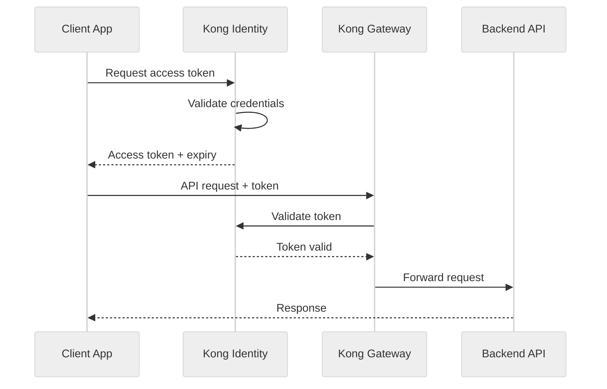

**Supported Plugins:**
- OpenID Connect plugin
- OAuth 2.0 Introspection plugin
- Upstream OAuth plugin

#### 6. Metering & Billing
Full system for tracking real-time usage, pricing products, enforcing entitlements, and generating invoices.

#### 7. Konnect Debugger
Real-time trace-level visibility into API traffic for troubleshooting.

| Feature | Description |
|---------|-------------|
| **On-Demand Tracing** | Targeted deep traces on specific data planes |
| **Request Lifecycle** | Visualize entire request processing pipeline |
| **Plugin Execution** | See order and timing of all plugin executions |
| **Sampling Criteria** | Filter traces by method, path, status, latency |
| **Log Correlation** | Traces correlated with Kong Gateway logs |
| **7-Day Retention** | Debug sessions retained for up to 7 days |

### Data Plane Hosting Options

Kong Konnect supports multiple data plane hosting options:

| Option | Description | Best For |
|--------|-------------|----------|
| **Dedicated Cloud Gateways** | Fully-managed by Kong in AWS, Azure, or GCP | Zero-ops, automatic scaling |
| **Serverless Gateways** | Lightweight, auto-provisioned gateways | Dev/test, rapid experimentation |
| **Self-Hosted** | Deploy on your infrastructure (K8s, VMs, bare metal) | Data sovereignty, compliance |

**This demo uses Self-Hosted data planes on EKS.**

### Supported Geographic Regions

Konnect Control Planes are available in these regions:

| Region | Code | API Endpoint |
|--------|------|--------------|
| United States | `us` | `us.api.konghq.com` |
| Europe | `eu` | `eu.api.konghq.com` |
| Australia | `au` | `au.api.konghq.com` |
| Middle East | `me` | `me.api.konghq.com` |
| India | `in` | `in.api.konghq.com` |
| Singapore (Beta) | `sg` | `sg.api.konghq.com` |

### AI Gateway Capabilities

Kong AI Gateway is built on top of Kong Gateway, designed for AI/LLM adoption:

- **AI Rate Limiting**: Rate limit by tokens, requests, or cost
- **AI Prompt Guard**: Filter and moderate prompts
- **AI Request Transformer**: Transform requests for different LLM providers
- **Multi-Provider Support**: OpenAI, Anthropic, Azure OpenAI, and more
- **MCP Tool Aggregation**: Aggregate MCP tools from multiple sources

### Security & Compliance

| Feature | Description |
|---------|-------------|
| **SSO/SAML/OIDC** | Enterprise identity provider integration |
| **Teams & Roles** | RBAC with custom teams and permissions |
| **Audit Logging** | Comprehensive audit logs for Konnect and Dev Portal |
| **CMEK** | Customer-Managed Encryption Keys |
| **Data Localization** | Geo-specific data storage and processing |
| **Multi-Geo Federation** | Federated API management across regions |

### Management Tools

| Tool | Use Case |
|------|----------|
| **decK** | Declarative configuration management via YAML/JSON |
| **Terraform Provider** | Infrastructure as Code for Konnect resources |
| **Kong Ingress Controller** | Kubernetes-native configuration via CRDs |
| **Konnect APIs** | Full programmatic control over all Konnect features |
| **KAi** | Kong's AI assistant for issue detection and fixes |

---

## Alternative: Kong Gateway OSS (Without Konnect)

If you don't have a Kong Konnect subscription and don't need Enterprise features, you can deploy with the **open-source Kong Gateway** instead.

### What You Lose Without Konnect

| Feature | Enterprise (Konnect) | OSS |
|---------|---------------------|-----|
| Enterprise plugins (OIDC, OPA, Vault, mTLS) | Yes | No |
| Centralized analytics dashboard | Yes | No — use Prometheus/Grafana |
| Developer Portal | Yes | No |
| Automatic license management | Yes | N/A |
| Kong Manager UI | Full | Limited |
| **Gateway API support** | **Full** | **Full** |
| **Core plugins (rate limiting, JWT, CORS, etc.)** | **Yes** | **Yes** |

### OSS Deployment Steps

**Skip the Konnect steps** in Step 4 (steps 1, 2, 5, 6) but **still create the Gateway TLS secret** for end-to-end encryption:

1. **Generate Gateway TLS Certificates and create the secret**
   ```bash
   ./scripts/01-generate-certs.sh
   kubectl create namespace kong
   kubectl create secret tls kong-gateway-tls -n kong \
     --cert=certs/server.crt \
     --key=certs/server.key
   ```

2. **Use the OSS Helm values** (`k8s/kong/values.yaml` instead of `konnect-values.yaml`):
   ```yaml
   image:
     repository: kong/kong    # OSS image (not kong/kong-gateway)
     tag: "3.9"

   ingressController:
     enabled: true
     # No konnect section needed

   gateway:
     env:
       database: "off"        # DB-less mode
       # No konnect_mode, cluster_*, or role settings needed
   ```

3. **Update the ArgoCD app** (`argocd/apps/02-kong-gateway.yaml`) to reference `values.yaml` instead of `konnect-values.yaml`

4. **Deploy Steps 1-3, then Step 5-6 directly** — ArgoCD will deploy Kong Gateway OSS without Konnect

> **Note:** The Gateway API resources (GatewayClass, Gateway, HTTPRoute) work identically with both editions. Only the available plugin set and management capabilities differ.

---

## Appendix: Kong as an External API Management Layer (Replacing AWS API Gateway)

In the [Istio POC architecture](https://github.com/shanaka-versent/EKS-Istio-GatewayAPI-Deom/tree/k8s-gateway-api-poc), **AWS API Gateway** sits **outside** the EKS cluster as a separate API management layer — it is not deployed inside K8s. Can Kong do the same? **Yes.** Kong Gateway can be deployed on **separate compute (EC2/ECS) in your VPC** — outside the EKS cluster but inside your private network — giving you the same external API management position as AWS API Gateway, with **fully private connectivity and no public endpoints**.

Alternatively, Kong Konnect provides **Dedicated Cloud Gateways** — fully managed instances on Kong's infrastructure — but this introduces a public endpoint (see [deployment options](#deployment-options-for-kong-outside-the-cluster) for the security trade-offs).

### Kong for API Management with Istio Gateway (Similar to AWS API Gateway)

The recommended approach is to deploy Kong on **separate compute in your VPC** — outside the EKS cluster but still in private subnets. CloudFront connects via **VPC Origin (PrivateLink)**, making Kong completely unreachable from the public internet:

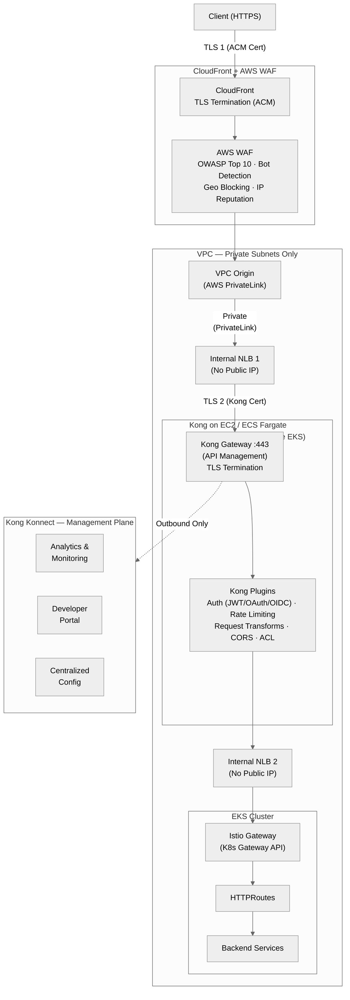

### Where Does Each Layer Sit?

| Layer | AWS API Gateway (Current) | Kong Replacement | Location |
|-------|---------------------------|------------------|----------|
| **CDN + WAF** | CloudFront + AWS WAF | CloudFront + AWS WAF (unchanged) | AWS Edge |
| **API Management** | AWS API Gateway (managed, public endpoint) | **Kong Gateway on EC2/ECS** (self-hosted, **no public endpoint**) | **Your VPC — private subnets** (outside EKS but inside your network) |
| **Management Plane** | AWS Console / CloudWatch | **Kong Konnect SaaS** — analytics, dev portal, centralized config | Kong's SaaS at `cloud.konghq.com` (outbound only) |
| **CloudFront → API Mgmt** | Public HTTPS to API GW endpoint | **VPC Origin (PrivateLink)** → Internal NLB → Kong — fully private | AWS backbone (private) |
| **API Mgmt → K8s** | VPC Link → NLB | Internal NLB → Istio Gateway — same VPC | Private subnets |
| **K8s Gateway API** | Istio Gateway | Istio Gateway (unchanged) | Inside the EKS cluster |
| **Service Mesh** | Istio Ambient (optional) | Istio Ambient (unchanged) | Inside the EKS cluster |

### Deployment Options for Kong Outside the Cluster

There are **two ways** to deploy Kong as an external API management layer, and they have **very different security models** for the CloudFront → Kong link:

#### Option 1: Self-Hosted Kong in Your VPC (Truly Private — Recommended)

Deploy Kong Gateway on **EC2 instances or ECS Fargate** in your VPC's private subnets — outside the EKS cluster but still inside your network. This gives you a **fully private path with no public endpoint**, identical to how this repo's main architecture works.

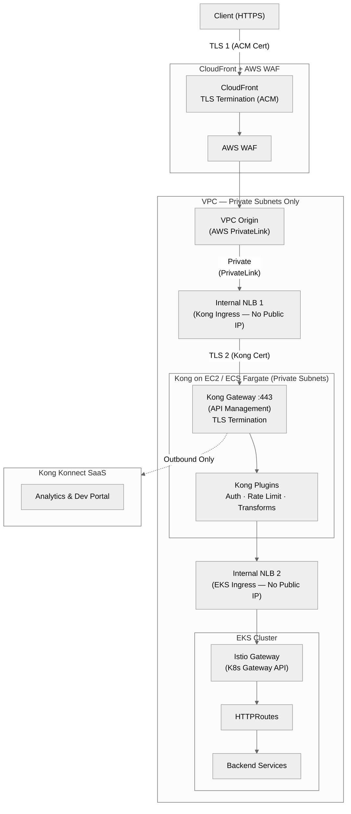

**Why this is truly private and bypass-proof:**

| Security Property | How It's Achieved |
|-------------------|-------------------|
| **Kong has no public endpoint** | Deployed in private subnets, no public IP, no Internet Gateway route |
| **Only CloudFront can reach Kong** | NLB 1 Security Group allows ingress **only** from CloudFront prefix list (`com.amazonaws.global.cloudfront.origin-facing`) |
| **Traffic never hits public internet** | CloudFront → VPC Origin (PrivateLink) → NLB 1 → Kong — all over AWS backbone |
| **Cannot bypass CloudFront** | Kong is not reachable from the internet at all. No DNS, no public IP, no public endpoint |
| **Dual TLS termination** | TLS 1 at CloudFront (ACM cert) + TLS 2 at Kong (private CA cert) — encrypted end-to-end |
| **Kong → EKS is also private** | Kong → NLB 2 → Istio Gateway — all within the same VPC, private subnets |

> **This is the same security model as this repo's main architecture** — the only difference is Kong runs on EC2/ECS instead of inside the EKS cluster. The VPC Origin + Internal NLB + Security Group pattern makes bypass **physically impossible**.

#### Option 2: Kong Konnect Dedicated Cloud Gateways (Managed by Kong)

Fully managed Kong data plane instances hosted on **Kong's infrastructure** (outside your AWS account). This is architecturally similar to how AWS API Gateway works — both are managed services with public endpoints.

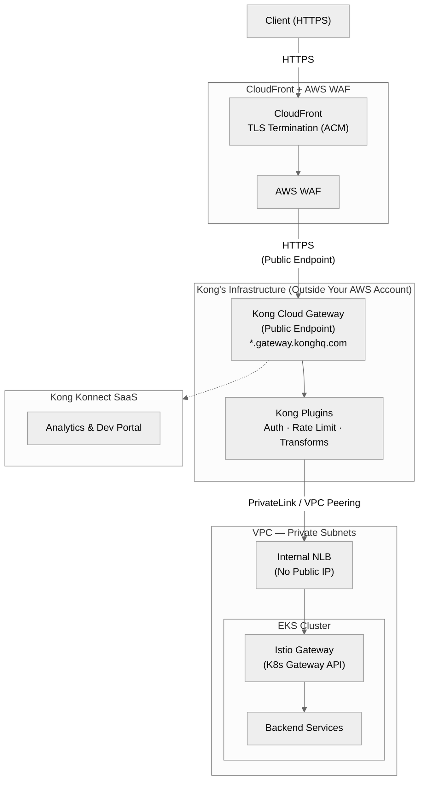

**The bypass problem:** Kong Cloud Gateway has a **public endpoint** (`*.gateway.konghq.com`) — just like AWS API Gateway has a public endpoint. Someone could potentially hit Kong directly, bypassing CloudFront and WAF.

**Bypass prevention (same techniques used with AWS API Gateway):**

| Technique | How It Works | Strength |
|-----------|-------------|----------|
| **Custom Origin Header (Shared Secret)** | CloudFront adds a secret header (e.g., `X-CF-Secret: <random-value>`) to every origin request. Kong validates it using the `request-termination` or `pre-function` plugin — rejects requests missing the header | ⭐⭐⭐ Standard approach. Same as CloudFront + API Gateway pattern. Secret should be rotated via Secrets Manager |
| **Mutual TLS (mTLS)** | CloudFront sends a client certificate to Kong. Kong validates the client cert before accepting the request | ⭐⭐⭐⭐ Cryptographic verification. Harder to spoof than headers. Requires CloudFront origin SSL client cert support |
| **IP Allowlisting** | Kong only accepts requests from CloudFront's IP ranges (published by AWS in `ip-ranges.json`) | ⭐⭐ Supplementary. CloudFront IPs are shared across all customers, so this alone isn't sufficient |
| **Kong ACL Plugin** | Combine authentication (API key / JWT) with ACL groups to restrict access to CloudFront's identity | ⭐⭐⭐ Application-layer control, managed entirely in Kong |

> **Important:** This is the **exact same challenge** as CloudFront + AWS API Gateway. AWS API Gateway also has a public endpoint. The standard mitigation is the **custom origin header** pattern — CloudFront injects a secret header, and the backend validates it. Kong handles this natively with plugins.

### Comparison: Which Option Is More Secure?

| Security Aspect | Option 1: Self-Hosted in VPC | Option 2: Kong Cloud Gateway |
|-----------------|------------------------------|------------------------------|
| **Kong has a public endpoint?** | ❌ No — private subnets, no public IP | ✅ Yes — `*.gateway.konghq.com` |
| **Can someone bypass CloudFront?** | ❌ Impossible — Kong is unreachable from internet | ⚠️ Possible without mitigation — requires shared secret header or mTLS |
| **CloudFront → Kong path** | Fully private (VPC Origin → PrivateLink → NLB) | Public HTTPS (CloudFront → Kong public endpoint) |
| **Network-level isolation** | VPC + Security Groups + no public route | Relies on application-layer controls (headers, mTLS) |
| **Bypass prevention mechanism** | Infrastructure-level (no public endpoint exists) | Application-level (shared secret header / mTLS) |
| **Same security model as** | This repo's main architecture | AWS API Gateway (same public endpoint challenge) |
| **Operational overhead** | You manage EC2/ECS compute, patching, scaling | Kong manages everything |
| **Kong → EKS connectivity** | Same VPC — NLB in private subnets | PrivateLink / VPC Peering from Kong's infra to your VPC |

### Recommendation

| Requirement | Recommended Option |
|-------------|-------------------|
| **Maximum security, no public endpoints** | Option 1 — Self-hosted Kong in VPC |
| **Regulatory/compliance (finance, healthcare)** | Option 1 — All traffic stays within your AWS account |
| **Minimal operational overhead** | Option 2 — Kong Cloud Gateway + shared secret header |
| **Fastest time to value** | Option 2 — No infrastructure to provision |
| **Multi-cloud portability** | Option 2 — Kong manages the data plane across clouds |

> **For organisations that require the same private connectivity model as this repo (no public endpoints, VPC Origin, PrivateLink), Option 1 (Self-Hosted Kong in your VPC) is the clear choice.** It gives you a fully managed-like experience via Konnect (config, analytics, dev portal) while keeping the data plane entirely within your private network — making CloudFront bypass physically impossible.

### WAF Placement

| Pattern | WAF Location | Why |
|---------|-------------|-----|
| **CloudFront + AWS API Gateway** | WAF attached to CloudFront **or** API Gateway (or both) | AWS API GW natively supports WAF attachment |
| **CloudFront + Kong Cloud Gateway** | WAF attached to **CloudFront only** | Kong Cloud Gateway is external — WAF at CloudFront filters traffic before it reaches Kong. Kong plugins handle API-specific concerns (auth, rate limiting) downstream |

AWS WAF and Kong plugins remain **complementary**:
- **WAF at CloudFront**: OWASP Top 10, bot detection, geo-blocking, IP reputation — stops malicious traffic at the edge
- **Kong Plugins**: JWT/OAuth/OIDC authentication, per-consumer rate limiting, request transforms — handles API-specific policies requiring application context

### When to Use This Pattern

- You have **APIs hosted outside of Kubernetes** (e.g., on EC2, ECS, Lambda, or third-party services) that need to be exposed and managed **alongside** APIs running on the EKS cluster — a single external API management layer provides a **unified entry point** for both
- You want **one consistent API management layer** across all backends — whether they run on K8s or not — with the same authentication, rate limiting, and plugin policies
- You're already using **Istio for K8s Gateway API routing** and service mesh inside the cluster, and only need an external layer for **cross-platform API management**
- You want to keep API management concerns **separated from K8s cluster operations** — different teams can manage APIs and cluster infrastructure independently
- You need a **developer portal** and **centralized API analytics** that span both K8s and non-K8s backends
- You want **consistent API management across multi-cloud** — the same Kong config works whether your backends are on AWS, Azure, or GCP

> **Key Insight:** In this pattern, nothing changes inside the EKS cluster. Istio Gateway, HTTPRoutes, and backend services remain exactly as they are. Kong sits outside as an API management layer that can front **both** K8s-hosted services (via Istio Gateway) and non-K8s services (via direct upstream routing) — giving you a single pane of glass for all your APIs regardless of where the backends run.

---

## Cleanup

```bash
# Delete ArgoCD apps first
kubectl delete -f argocd/apps/root-app.yaml

# Wait for resources to be cleaned up
sleep 60

# Destroy infrastructure
cd terraform
terraform destroy
```

## Related Projects

- [EKS Istio Gateway API POC](https://github.com/shanaka-versent/EKS-Istio-GatewayAPI-Deom/tree/k8s-gateway-api-poc) - Implementation 2: Istio + AWS API Gateway
- [AKS Istio Gateway API POC](https://github.com/shanaka-versent/AKS-Istio-GatewayAPI-Demo/tree/k8s-gateway-api-poc) - Azure AKS implementation with Istio

## Resources

- [Kong Gateway Documentation](https://developer.konghq.com/gateway/)
- [Kong Kubernetes Ingress Controller](https://developer.konghq.com/kubernetes-ingress-controller/)
- [Kong Konnect Platform](https://developer.konghq.com/konnect/)
- [Kong AI Gateway](https://developer.konghq.com/ai-gateway/)
- [Kong Developer Portal](https://developer.konghq.com/dev-portal/)
- [Kong Identity](https://developer.konghq.com/kong-identity/)
- [Konnect APIs Reference](https://developer.konghq.com/api/)
- [Kubernetes Gateway API Documentation](https://gateway-api.sigs.k8s.io/)
- [CloudFront VPC Origins](https://docs.aws.amazon.com/AmazonCloudFront/latest/DeveloperGuide/private-content-vpc-origins.html)
