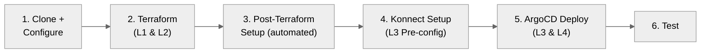

# AWS EKS with Kong Gateway as a K8s Gateway API Implementation with API Management

This POC demonstrates how to implement the **Kubernetes Gateway API** on AWS EKS using **Kong Gateway Enterprise**, integrated with **Kong Konnect** for centralized API management, analytics, and developer portal.

## Background

My previous POCs implemented the Kubernetes Gateway API using Istio — on both [AWS EKS](https://github.com/shanaka-versent/EKS-Istio-GatewayAPI-Deom/tree/k8s-gateway-api-poc) and [Azure AKS](https://github.com/shanaka-versent/AKS-Istio-GatewayAPI-Demo/tree/k8s-gateway-api-poc). This POC explores Kong Gateway as an alternative Gateway API implementation and compares what each brings to the table.

Both Istio and Kong implement the **Kubernetes Gateway API** standard for north-south traffic routing into the cluster. The key difference is what each brings beyond basic ingress:

| Capability | Istio Gateway | Kong Gateway |
|------------|---------------|--------------|
| K8s Gateway API (GatewayClass, Gateway, HTTPRoute) | Yes | Yes |
| API Management (rate limiting, auth, transforms) | No — requires a separate API gateway | Built-in (200+ plugins) |
| Service Mesh (east-west mTLS) | Yes (optional, independent of Gateway API) | No — not a service mesh |
| Developer Portal | No | Yes (via Kong Konnect) |
| Centralized Analytics | No | Yes (via Kong Konnect) |

In short: **Istio Gateway** gives you K8s Gateway API routing. **Kong Gateway** gives you K8s Gateway API routing **plus** API management — without needing a separate API gateway service.

## Key Architecture Decision — How to Deploy Kong for API Management

Before choosing a deployment model, it is important to understand how Kong Konnect configures gateways on Kubernetes — because a current platform limitation directly impacts the architecture.

### Kong Gateway Configuration Options on Kubernetes

When creating an API Gateway in Kong Konnect for Kubernetes, you are presented with three setup choices and one critical configuration decision:

**Where to run your gateway:** Self-managed (deploy anywhere), Serverless (learning and development), or Dedicated Cloud (enterprise-grade managed).

**How to run your gateway:** Docker, Linux binary, or Kubernetes.

**How to store your configuration (the critical choice):** This is where you choose the source of truth for your gateway configuration — also known as your control plane. This choice is **mutually exclusive and cannot be changed after creation**.

The screenshot below shows the Kong Konnect gateway creation screen as of February 2025:


As the built-in comparison table in the Konnect UI shows:

- **Konnect as source** (recommended by Kong) — Full UI/API configuration, Kubernetes CRDs, and Dev Portal. But **no Kubernetes Gateway API support**.
- **Kubernetes API server as source** (read-only in Konnect) — Full Kubernetes Gateway API support (`Gateway`, `HTTPRoute`, `GRPCRoute`). But Konnect becomes **read-only** — no UI configuration, no Dev Portal, no decK or Terraform management.

### The Limitation: You Cannot Have Both Today

**You cannot get full Konnect management AND Kubernetes Gateway API support in a single Kong Gateway instance.** This is a significant constraint for organisations that want:

- Kubernetes Gateway API compliance for cloud-native routing portability
- Full Konnect-managed API lifecycle management with UI access for API teams
- Dev Portal for API consumers
- Unified observability across all gateway layers

This limitation is expected to improve over time. As the Kubernetes Gateway API matures and becomes the de facto standard, Kong will almost certainly bring full Konnect management support — including Dev Portal, decK, Terraform, and UI-driven configuration — to Gateway API-configured gateways. When that happens, a single Kong Gateway instance could handle both API management and Kubernetes-native routing, simplifying architectures significantly.

However, as of February 2025, this trade-off exists and must be addressed architecturally.

### What This Means for Architecture

Given this limitation, there are three deployment models for using Kong as an API management layer. Each makes a different trade-off:

---

#### Option 1: Kong on K8s — Ingress (K8s Gateway API) + API Management (This Repo)

Kong is deployed **inside the EKS cluster** using **"Kubernetes API server as source"**. This means Kong serves as both the Kubernetes Gateway API implementation and the API management layer — handling ingress routing, authentication, rate limiting, and all API policies in one place.

**The trade-off:** Because the configuration source is the K8s API server, Konnect is **read-only**. You manage all configuration (routes, plugins, consumers) through Kubernetes CRDs and GitOps — not through the Konnect UI. Native Konnect analytics is **not available** with this pattern (see [Known Limitations](#known-limitations)) — API observability is provided via the Prometheus plugin instead. You also lose UI-driven configuration, Dev Portal, and decK/Terraform Konnect provider support.

**What you get:**
- Single component for both Gateway API routing and API management
- Full Kubernetes Gateway API compliance (`Gateway`, `HTTPRoute`, `GRPCRoute`)
- All Kong plugins available (rate limiting, JWT, CORS, transforms, etc.) via KongPlugin CRDs
- API observability via Prometheus plugin (per-route request counts, latency, status codes)
- GitOps-native configuration — everything is Kubernetes YAML

**What you lose (due to Konnect being read-only):**
- No native Konnect analytics — API observability via Prometheus plugin (see [Known Limitations](#known-limitations))
- No UI-driven configuration from the Konnect dashboard
- No Dev Portal
- No decK or Terraform Konnect provider for gateway configuration
- Configuration management is purely through Kubernetes CRDs

**Choose this when:** Your APIs are primarily hosted on Kubernetes, your team is comfortable with GitOps-driven configuration, and you want a single in-cluster component for both routing and API management. This is the most operationally simple approach and avoids the cost of running a separate API management layer.

**Future consolidation:** When Kong brings full Konnect management to Gateway API-configured gateways, this option becomes the ideal single-gateway architecture — you would gain UI-driven configuration, Dev Portal, and decK/Terraform support without changing the deployment model.

> **This repo implements Option 1.** See the [Detailed Architecture](#detailed-architecture) section below for the full implementation.

---

#### Option 2: Kong on K8s — Konnect as Source (Full API Management, No K8s Gateway API) ([Separate Repo](https://github.com/shanaka-versent/Kong-Konnect-Mgmt-Gateway-on-EKS))

Kong is deployed **inside the EKS cluster** using **"Konnect as source"** (recommended by Kong). This gives you the full Konnect management experience — UI-driven configuration, Dev Portal, native analytics, decK, and Terraform — but Kong does **not** implement the Kubernetes Gateway API. Kong replaces Istio Gateway as the ingress layer, handling both routing and API management, but uses Kong's own routing configuration (via Konnect/decK) rather than Gateway API CRDs.

**The trade-off:** You get every Konnect feature — full dashboard control, Dev Portal, native analytics, decK/Terraform — but you lose Kubernetes Gateway API compliance. Routing is managed through Konnect UI or decK rather than `Gateway`/`HTTPRoute` CRDs. This means no portability to other Gateway API implementations and no GitOps-native K8s routing.

**What you get:**
- Full Konnect UI/API management — configure routes, plugins, consumers from the dashboard
- Dev Portal for API discovery and self-service consumer onboarding
- Native Konnect analytics — full traffic metrics, latency dashboards, error tracking
- decK and Terraform Konnect provider for declarative API management
- Single in-cluster component (Kong replaces Istio Gateway)
- All Kong plugins available (rate limiting, JWT, CORS, transforms, etc.)

**What you lose:**
- No Kubernetes Gateway API support (`Gateway`, `HTTPRoute`, `GRPCRoute`)
- No GitOps-native K8s routing — routes managed via Konnect/decK, not K8s CRDs
- No portability to other Gateway API implementations (Istio, Envoy Gateway, etc.)
- Vendor lock-in to Kong's routing configuration model

**Choose this when:** You want the full Konnect experience (especially Dev Portal, native analytics, and UI-driven configuration), your APIs are primarily on Kubernetes, and you don't need Kubernetes Gateway API portability. This is the simplest path to full API management with minimal infrastructure.

**Future consolidation:** When Kong adds Kubernetes Gateway API support to "Konnect as source" control planes, this option would gain Gateway API compliance without changing the deployment model — becoming the ideal single-gateway architecture.

> **Option 2 is implemented in a separate repository:** [Kong-Konnect-Mgmt-Gateway-on-EKS](https://github.com/shanaka-versent/Kong-Konnect-Mgmt-Gateway-on-EKS) *(coming soon)*

---

#### Option 3: Kong External to K8s — Centralised API Management ([Covered in Appendix](#appendix-kong-as-an-external-api-management-layer) & Separate Repo)

Kong is deployed **outside the EKS cluster** (on EC2/ECS or as a Kong Konnect Dedicated Cloud Gateway) using **"Konnect as source"**. This gives you the full Konnect management experience — UI-driven configuration, Dev Portal, analytics, decK, and Terraform — but Kong does not implement the Kubernetes Gateway API. A separate Gateway API implementation (e.g., Istio Gateway) handles K8s routing inside the cluster.

**The trade-off:** You need two components — Kong for API management and Istio Gateway (or another Gateway API implementation) for Kubernetes-native routing. This adds an extra network hop and requires two observability stacks (Konnect for API metrics, Kiali/Grafana for Istio metrics).

**What you get:**
- Full Konnect UI/API management — configure plugins, consumers, rate limiting from the dashboard
- Dev Portal for API discovery and self-service consumer onboarding
- decK and Terraform Konnect provider for declarative API policy management
- Full analytics and real-time dashboards in Konnect
- Ability to manage APIs across multiple platforms (K8s, EC2, ECS, Lambda) through a single API management layer
- Kubernetes Gateway API compliance via Istio Gateway (or another implementation)

**What you lose:**
- Additional network hop (Kong → Istio Gateway → backend services)
- Two observability stacks to manage (Konnect + Kiali/Grafana)
- More complex deployment with more moving parts

**Choose this when:** You need full Konnect management capabilities (especially Dev Portal and UI-driven configuration), you have APIs across multiple platforms that need unified management, or you want to keep API management concerns fully separated from K8s cluster operations.

**Future consolidation:** When Kong matures its Gateway API support with full Konnect integration, you could move Kong into the cluster as a single gateway, removing the need for Istio Gateway and simplifying the architecture.

> **Option 3 is covered in the [Appendix](#appendix-kong-as-an-external-api-management-layer) below and in a separate repository:** [EKS-Kong-Istio-API-Management-Demo](https://github.com/shanaka-versent/EKS-Kong-Istio-API-Management-Demo) *(coming soon)*
>
> The Appendix details the architecture. The separate repo implements it, as described in the companion blog post: [Enterprise API Management on Amazon EKS: Kong Gateway with Istio Ambient Mesh](#).

---

### Quick Comparison

| | Option 1: Kong K8s API Source (This Repo) | Option 2: Kong Konnect Source ([Separate Repo](https://github.com/shanaka-versent/Kong-Konnect-Mgmt-Gateway-on-EKS)) | Option 3: Kong External ([Separate Repo](https://github.com/shanaka-versent/EKS-Kong-Istio-API-Management-Demo)) |
|---|---|---|---|
| **Kong config source** | K8s API server | Konnect | Konnect |
| **K8s Gateway API** | ✅ Native | ❌ Not supported | Via Istio Gateway |
| **Konnect UI management** | ❌ Read-only | ✅ Full | ✅ Full |
| **Dev Portal** | ❌ | ✅ | ✅ |
| **decK / Terraform** | ❌ | ✅ | ✅ |
| **Analytics** | Via Prometheus plugin (see [limitation](#known-limitations)) | ✅ Full (Konnect native) | ✅ Full (Konnect native) |
| **Components in cluster** | Kong only | Kong only | Kong + Istio Gateway |
| **Network hops** | 1 (Kong → backend) | 1 (Kong → backend) | 2 (Kong → Istio GW → backend) |
| **Best for** | K8s-first, GitOps teams | Full Konnect experience, K8s-hosted APIs | Multi-platform, UI-driven teams |
| **Consolidation path** | Gains full Konnect when Kong adds support | Gains Gateway API when Kong adds support | Removes Istio Gateway when Kong adds support |

> **Note:** All three options use the same Kong Gateway Enterprise with the same plugin ecosystem. The difference is how configuration is managed, whether the Kubernetes Gateway API is used, and what Konnect features are available.

---

> **Licensing:** This project uses **Kong Gateway Enterprise** (`kong/kong-gateway` image) with licensing automatically managed by Kong Konnect. A [free trial](https://konghq.com/products/kong-konnect/register) gives you 30 days of full Enterprise functionality. An [OSS alternative](#alternative-kong-gateway-oss-without-konnect) is available if you don't have a Konnect subscription.

---

## High-level Architecture

All implementations in this series follow a common reference architecture. The pattern is **cloud-agnostic** and applies to both AWS (CloudFront) and Azure (Front Door).

```mermaid
%%{init: {'theme': 'neutral', 'themeVariables': {'primaryColor': '#ECECFF', 'primaryBorderColor': '#9370DB', 'lineColor': '#666', 'secondaryColor': '#ffffde'}}}%%
flowchart TB
    Client["Client"]

    subgraph Edge["Edge / CDN Layer"]
        CDN["CDN + WAF"]
    end

    subgraph Private["Private Connectivity"]
        PL["Private Link / VPC Origin"]
    end

    subgraph Cloud["Cloud VPC / VNet — Private Subnets"]
        ILB["Internal Load Balancer"]

        subgraph K8s["Kubernetes Cluster"]
            APIGW["API Gateway"]
            GW["K8s Gateway API"]
            SVC["Backend Services"]
        end
    end

    Client -->|"TLS 1 🔒"| CDN
    CDN -->|"Decrypt 🔓 → Re-encrypt 🔒"| PL
    PL --> ILB
    ILB -->|"TLS 2 🔒"| APIGW
    APIGW -->|"Decrypt 🔓"| GW
    GW -->|"Plain HTTP"| SVC
```



| Layer | Responsibility | Cloud Agnostic |
|-------|---------------|----------------|
| **CDN + WAF** | DDoS protection, geo-blocking, TLS termination, WAF rules (SQLi, XSS, rate limiting) | AWS CloudFront / Azure Front Door |
| **Private Connectivity** | End-to-end private path from edge to VPC — no public endpoints | AWS VPC Origin / Azure Private Link |
| **Internal Load Balancer** | L4 load balancing in private subnets, health checks | AWS NLB / Azure Internal LB |
| **API Gateway Capability** | Auth, rate limiting, request transforms, API key management | Kong, AWS API GW, or built into K8s GW |
| **K8s Gateway API** | Path-based routing via HTTPRoute CRDs, namespace isolation | Kong GatewayClass, Istio GatewayClass |
| **Backend Services** | Application workloads (APIs, web apps, microservices) | K8s Deployments + Services |

> **Key Security Property:** The Internal Load Balancer has NO public endpoint. Private connectivity from the CDN uses AWS-managed ENIs (VPC Origin) or Azure Private Endpoints. **It is impossible to bypass the CDN/WAF layer.**

---

## Detailed Architecture

Kong Gateway serves as BOTH the API Gateway and the Kubernetes Gateway API implementation. All traffic (web + API) flows through a single path.

```mermaid
%%{init: {'theme': 'neutral', 'themeVariables': {'primaryColor': '#ECECFF', 'primaryBorderColor': '#9370DB', 'lineColor': '#666', 'secondaryColor': '#ffffde', 'fontSize': '16px'}, 'flowchart': {'nodeSpacing': 50, 'rankSpacing': 80, 'padding': 30}}}%%
flowchart TB
    Client["Client"]

    subgraph Edge["CloudFront Edge"]
        direction LR
        CF["CloudFront<br/>ACM Certificate<br/>━━━━━━━━━━━━━━━<br/>🔓 TLS Termination<br/>🔒 Re-encrypt to origin"]
        WAF["AWS WAF<br/>SQLi · XSS · Rate Limit"]
    end

    subgraph VPC["AWS VPC — Private Subnets Only"]
        VPCOrigin["VPC Origin<br/>(AWS PrivateLink)<br/>━━━━━━━━━━━━━━━<br/>🔒 Encrypted in transit"]
        NLB["Internal NLB :443<br/>━━━━━━━━━━━━━━━<br/>TCP Passthrough<br/>(no TLS termination)"]

        subgraph EKS["EKS Cluster"]
            TGB["TargetGroupBinding"]

            subgraph KongNS["kong namespace"]
                GWClass["GatewayClass: kong"]
                GW["Gateway: kong-gateway<br/>Listener: HTTPS :443<br/>TLS: kong-gateway-tls"]
                KIC["Kong Ingress Controller"]
                KongDP["Kong Gateway Pods (x2)<br/>Let's Encrypt Certificate<br/>━━━━━━━━━━━━━━━<br/>🔓 TLS Termination :8443<br/>(end of encrypted path)"]
            end

            subgraph CertNS["cert-manager namespace"]
                CM["cert-manager"]
                CI["ClusterIssuer:<br/>letsencrypt-production"]
            end

            subgraph API["api namespace"]
                APIRoute["HTTPRoute: users-api-route<br/>/api/users → users-api:8080"]
                RL["KongPlugin: rate-limiting<br/>100/min per IP"]
                RT["KongPlugin: request-transformer<br/>Add X-Request-ID, X-Kong-Proxy"]
                CORS["KongPlugin: cors"]
                UsersAPI["users-api (nginx)"]
                RG1["ReferenceGrant"]
            end

            subgraph TA1["tenant-app1 namespace"]
                App1Route["HTTPRoute: app1-route<br/>/app1 → sample-app-1:8080"]
                App1["sample-app-1 (nginx)"]
                RG2["ReferenceGrant"]
            end

            subgraph TA2["tenant-app2 namespace"]
                App2Route["HTTPRoute: app2-route<br/>/app2 → sample-app-2:8080"]
                App2["sample-app-2 (nginx)"]
                RG3["ReferenceGrant"]
            end

            subgraph GH["gateway-health namespace"]
                HealthRoute["HTTPRoute: health-route<br/>/healthz → health-responder:8080"]
                HealthPod["health-responder (nginx)"]
                RG4["ReferenceGrant"]
            end
        end
    end

    subgraph Konnect["Kong Konnect SaaS"]
        direction LR
        ConfigSync["Config Sync<br/>(read-only)"]
        License["Enterprise<br/>License"]
    end

    subgraph R53["AWS Route53"]
        DNS["kong.mydomain.com<br/>(DNS-01 challenge)"]
    end

    Client -->|"🔒 HTTPS :443<br/>TLS Session 1"| CF
    CF --> WAF
    WAF -->|"🔒 HTTPS :443<br/>TLS Session 2 (re-encrypted)"| VPCOrigin
    VPCOrigin -->|"🔒 Encrypted"| NLB
    NLB -->|"🔒 TCP passthrough :8443<br/>(no termination)"| TGB
    TGB --> KongDP

    GWClass --> KIC
    GW --> KIC
    KIC -->|"configures"| KongDP

    CM -->|"issues cert via DNS-01"| R53
    CM -->|"kong-gateway-tls secret"| GW
    CI --> CM

    KongDP -->|"Plain HTTP :8080<br/>(unencrypted)"| APIRoute
    APIRoute --> RL & RT & CORS
    RL & RT & CORS --> UsersAPI

    KongDP -->|"Plain HTTP :8080<br/>(unencrypted)"| App1Route
    App1Route --> App1

    KongDP -->|"Plain HTTP :8080<br/>(unencrypted)"| App2Route
    App2Route --> App2

    KongDP -->|"Plain HTTP :8080<br/>(unencrypted)"| HealthRoute
    HealthRoute --> HealthPod

    KIC -.->|"config sync +<br/>node registration (mTLS)"| ConfigSync
    KIC -.->|"license fetch"| License

```



**Traffic Flow (End-to-End Encryption):**
```
Client ──🔒 TLS 1──→ CloudFront (Decrypt 🔓 + WAF + Re-encrypt 🔒) ──🔒 TLS 2──→ VPC Origin ──→ NLB :443 (passthrough) ──→ Kong :8443 (Decrypt 🔓) ──Plain HTTP──→ Backend :8080
```

**Key Design Decisions:**
- **Single traffic path** — all requests (web + API) flow through Kong Gateway, no split paths
- **End-to-end TLS** — dual TLS termination (ACM at CloudFront, Let's Encrypt at Kong) with NLB TCP passthrough
- **Automated certificates** — cert-manager handles Let's Encrypt issuance and renewal via DNS-01 challenge on Route53 (zero manual cert management)
- **Namespace isolation** — each tenant and the API have their own namespace with ReferenceGrant for cross-namespace routing
- **Plugins per-route** — only `/api/users` has rate limiting, request transforms, and CORS; tenant apps are clean pass-through
- **Terraform-managed NLB** — created before Kong deploys (avoids chicken-and-egg with CloudFront VPC Origin)
- **Split deployment** — KIC (controller) and Kong Gateway (data plane) are separate Helm releases; KIC syncs config + nodes to Konnect
- **Kong Konnect** — config visibility and licensing via SaaS; admin API exposed only as ClusterIP for KIC gateway discovery
- **API observability** — Prometheus plugin provides per-route request counts, latency histograms, status codes, and bandwidth metrics (native Konnect analytics is unavailable with the KIC + Gateway Discovery pattern — see [Known Limitations](#known-limitations))

### Node Pool Layout

| Node Pool | Taint | Workloads |
|-----------|-------|-----------|
| System Nodes | CriticalAddonsOnly | ArgoCD, cert-manager, Kong components, AWS LB Controller |
| User Nodes | None | Application workloads (app1, app2, users-api) |

---

## End-to-End Traffic Flow

The architecture implements **dual TLS termination** for end-to-end encryption, with fully private internal connectivity via VPC Origin (PrivateLink). No public endpoints are exposed inside the VPC.

```mermaid
sequenceDiagram
    participant Client
    participant CF as CloudFront + WAF
    participant NLB as Internal NLB
    participant Kong as Kong Gateway<br/>(kong namespace)
    participant App as Backend Service

    Note over Client,CF: 🔒 TLS Session 1 (ACM Certificate)
    Client->>+CF: HTTPS :443 (Encrypted)
    CF->>CF: 🔓 Decrypt TLS 1
    CF->>CF: WAF Rules (SQLi, XSS, Rate Limit)

    Note over CF,Kong: 🔒 TLS Session 2 (Let's Encrypt Certificate)
    CF->>CF: 🔒 Re-encrypt for origin
    CF->>+NLB: HTTPS :443 via VPC Origin (Encrypted)
    NLB->>+Kong: TCP Passthrough :8443 (No decrypt)
    Kong->>Kong: 🔓 Decrypt TLS 2<br/>(kong-gateway-tls secret)

    Note over Kong,App: Plain HTTP (Cluster-internal, unencrypted)
    alt /api/users - API Route (with plugins)
        Kong->>Kong: jwt-auth (verify Bearer token)
        Kong->>Kong: rate-limiting (100/min per IP)
        Kong->>Kong: request-transformer (add headers)
        Kong->>Kong: cors (browser access)
        Kong->>+App: HTTP :8080 → users-api (api namespace)
        App-->>-Kong: JSON Response
    else /app1 - Web Route (pass-through)
        Kong->>+App: HTTP :8080 → sample-app-1 (tenant-app1 namespace)
        App-->>-Kong: Response
    else /app2 - Web Route (pass-through)
        Kong->>+App: HTTP :8080 → sample-app-2 (tenant-app2 namespace)
        App-->>-Kong: Response
    else /healthz/* - Health Probe
        Kong->>+App: HTTP :8080 → health-responder (gateway-health namespace)
        App-->>-Kong: 200 OK
    end

    Kong-->>-NLB: Response
    NLB-->>-CF: Response
    CF-->>-Client: HTTPS Response
```



### TLS Certificate Chain

| Component | Certificate | Managed By | Purpose |
|-----------|-------------|------------|---------|
| **CloudFront Frontend** | ACM Certificate | AWS ACM (auto-renew) | Terminates client HTTPS, provides trusted public certificate |
| **Kong Gateway Backend** | Let's Encrypt cert (`kong-gateway-tls` secret) | cert-manager (auto-renew every 60 days) | Terminates re-encrypted traffic from CloudFront via NLB |
| **Kong → Backend Pods** | Plain HTTP | N/A | Cluster-internal traffic on port 8080 |

> **Zero certificate maintenance:** Both certificates are fully automated. ACM auto-renews the CloudFront cert. cert-manager auto-renews the Let's Encrypt cert 30 days before its 90-day expiry. No manual certificate rotation required.

---

## How Kong Implements the Kubernetes Gateway API

Kong Gateway implements the Kubernetes Gateway API **exactly like Istio does**. The architecture is directly comparable:

| Component | Istio | Kong |
|-----------|-------|------|
| **Controller** (watches Gateway API resources) | Istiod | Kong Ingress Controller (KIC) |
| **Data Plane** (processes traffic) | Envoy Proxy | Kong Gateway |
| **GatewayClass controllerName** | `gateway.istio.io/gateway-controller` | `konghq.com/kic-gateway-controller` |


**Key resources in this project:**
- **GatewayClass** (`k8s/kong/gateway-class.yaml`): Registers Kong as the Gateway API implementation
- **Gateway** (`k8s/kong/gateway.yaml`): Creates the Kong Gateway instance listening on HTTPS :443 with Let's Encrypt TLS (`kong-gateway-tls` secret)
- **HTTPRoute** resources (`k8s/apps/*/httproute.yaml`): Define path-based routing rules

> **Note:** This is the same Gateway API standard. If you've used Istio's Gateway API implementation, switching to Kong only requires changing the `gatewayClassName` — the HTTPRoute resources remain identical.

> **Note:** API management (north-south) and service mesh (east-west) are complementary concerns. You can use Kong Gateway at the edge for API management and Istio Ambient internally for service-to-service mTLS — they work together.

---

## Architecture Layers


| Layer | Tool | What It Creates |
|-------|------|-----------------|
| **Layer 1** | Terraform | VPC, Subnets (Public/Private), NAT/IGW, Route Tables |
| **Layer 2** | Terraform | EKS, Node Groups, IAM (IRSA for LB Controller + cert-manager), LB Controller, Internal NLB (port 443), CloudFront + WAF + VPC Origin (https-only), Route53 hosted zone, ArgoCD |
| **Layer 3 Pre-config** | kubectl + Konnect API | kong namespace, Konnect mTLS certificates (`konnect-client-tls` secret), Helm values with Konnect endpoints |
| **Layer 3** | ArgoCD | Gateway API CRDs, cert-manager (Let's Encrypt via DNS-01), Kong Gateway Enterprise (ClusterIP), Gateway + auto-managed TLS (`kong-gateway-tls` secret), HTTPRoutes, Kong Plugins |
| **Layer 4** | ArgoCD | Applications (app1, app2, users-api, health-responder) |

---

## Security

Security is applied at every layer. WAF handles infrastructure threats at the edge, Kong plugins handle application/API concerns inside the cluster.


| Layer | What | Example Threats Blocked |
|-------|------|------------------------|
| **Edge (WAF)** | AWS Managed Rules | SQL injection, XSS, known bad inputs, bot floods |
| **Network (NLB)** | Security Groups | Direct access bypass, unauthorized CIDR ranges |
| **Application (Kong)** | Plugins | Unauthenticated API calls, excessive per-consumer requests |
| **Workload (K8s)** | Pod Security | Container escape, privilege escalation, resource abuse |

---

## Kong Plugin Chain


### Rate Limiting
```yaml
apiVersion: configuration.konghq.com/v1
kind: KongPlugin
metadata:
  name: rate-limiting
config:
  minute: 100
  policy: local
  limit_by: ip
plugin: rate-limiting
```

### JWT Authentication
```yaml
apiVersion: configuration.konghq.com/v1
kind: KongPlugin
metadata:
  name: jwt-auth
config:
  claims_to_verify:
  - exp
plugin: jwt
```

A demo consumer (`demo-user`) with HMAC-SHA256 credentials is deployed automatically via ArgoCD from `k8s/apps/api/jwt-auth.yaml`. Generate a test token with `./scripts/02-generate-jwt.sh`.

### CORS
```yaml
apiVersion: configuration.konghq.com/v1
kind: KongPlugin
metadata:
  name: cors
config:
  origins: ["*"]
  methods: [GET, POST, PUT, DELETE]
plugin: cors
```

---

## Health Check Flow

NLB health probes target Kong's status endpoint directly. Application health checks route through Kong to the health-responder service:


---

## Prerequisites

- AWS CLI configured with appropriate credentials
- Terraform >= 1.5
- kubectl
- Helm 3.x
- Kong Konnect account ([free trial](https://konghq.com/products/kong-konnect/register) or paid subscription)
- A domain name you control (for end-to-end TLS with Let's Encrypt) — configure in `terraform/variables.tf` (`domain_name` variable, e.g., `kong.mydomain.com`)

## Deployment Steps



### Step 1: Clone and Configure

```bash
git clone https://github.com/shanaka-versent/EKS-Kong-GatewayAPI-Demo.git
cd EKS-Kong-GatewayAPI-Demo
```

Set your domain in `terraform/variables.tf`:
```hcl
variable "domain_name" {
  default = "kong.mydomain.com"  # ← Your subdomain for Let's Encrypt + CloudFront SNI
}
```

### Step 2: Deploy Infrastructure (Layers 1 & 2)

```bash
cd terraform
terraform init

# Deploy with CloudFront + WAF + VPC Origin + Route53 + cert-manager IRSA
terraform apply -var="enable_cloudfront=true"
```

<details>
<summary>What does this create?</summary>

VPC, EKS, Node Groups, IAM/IRSA, Internal NLB (:443), CloudFront + WAF + VPC Origin, Route53 hosted zone, cert-manager IRSA role, and ArgoCD.

> **Note:** The VPC Origin can take 15+ minutes to deploy.

</details>

### Step 3: Post-Terraform Setup (Automated)

After `terraform apply`, run the setup script to inject Terraform outputs into the K8s and ArgoCD manifests:

```bash
# Configure kubectl
$(terraform output -raw eks_get_credentials_command)

# Run post-terraform setup
cd ..
./scripts/03-post-terraform-setup.sh
```

<details>
<summary>What does this script do?</summary>

This script automatically:
- Reads `terraform output` values (Route53 zone ID, cert-manager IRSA role ARN, domain name)
- Updates `k8s/cert-manager/cluster-issuer.yaml` with the correct Route53 zone ID and domain
- Updates `k8s/cert-manager/certificate.yaml` with your domain name
- Updates `argocd/apps/00b-cert-manager.yaml` with the cert-manager IRSA role ARN
- Prints DNS delegation instructions

> **Preview changes first:** Run `./scripts/03-post-terraform-setup.sh --dry-run` to see what would change without modifying files.

</details>

<details>
<summary>DNS Delegation (required for Let's Encrypt)</summary>

If your parent domain (e.g., `mydomain.com`) is in a different AWS account or registrar, the script will print the NS records. Create an NS record in the parent domain's DNS to delegate the subdomain:

```bash
# The setup script prints these, or get them manually:
cd terraform && terraform output route53_name_servers

# In the parent domain's DNS, create:
#   Name:  kong.mydomain.com
#   Type:  NS
#   Value: <the 4 name servers from above>

# Verify delegation (may take a few minutes to propagate):
dig NS kong.mydomain.com
```

</details>

### Step 4: Configure Kong Konnect Integration (Layer 3 Pre-config)

This step **must be completed before Step 5**. The only manual pre-requisite is creating the mTLS certificate secret that authenticates Kong components to Konnect.

> **Don't have a Konnect account?** See the [OSS alternative](#alternative-kong-gateway-oss-without-konnect) to deploy without Konnect.

<details>
<summary>Why is this step needed?</summary>

ArgoCD deploys Kong as a **split deployment** — the data plane and KIC controller are separate Helm releases, both connecting to Konnect independently.

> **Gateway TLS (end-to-end encryption)** is handled automatically by **cert-manager** — no manual certificate generation required for proxy TLS. The certificate generated here is **only for Konnect mTLS authentication**.

</details>

#### 4a. Create a Control Plane in Konnect

1. Sign in to [cloud.konghq.com](https://cloud.konghq.com) → **Gateway Manager** → **[+ New Control Plane](https://cloud.konghq.com/gateway-manager/create-gateway)**
2. Select **Kong Ingress Controller** as the control plane type
3. Name it (e.g., `eks-demo`) → **Create**
4. Note the **Control Plane ID** (UUID shown in the URL or dashboard)
5. Generate a **Personal Access Token**: Account Settings → **[API Keys](https://cloud.konghq.com/global/account/tokens)** → **Generate Token**

#### 4b. Generate mTLS Certificate and Create K8s Secret

Generate a self-signed certificate locally, register it with Konnect via API, and create the K8s secret.

> **Automation:** You can use `./scripts/setup-konnect.sh` to automate Steps 4b and print the endpoints for Step 4c. Set `KONNECT_REGION`, `KONNECT_TOKEN`, and `CONTROL_PLANE_ID` environment variables first.

<details>
<summary>Manual steps (if not using the automation script)</summary>

```bash
# Generate self-signed mTLS certificate for Konnect authentication
openssl req -new -x509 -nodes -newkey rsa:2048 \
  -subj "/CN=kongdp/C=US" \
  -keyout ./tls.key -out ./tls.crt -days 365

# Register the certificate with Konnect (via API — no UI needed)
export KONNECT_REGION="us"              # us, eu, au, me, in, sg
export KONNECT_TOKEN="kpat_xxx..."      # Personal access token from Step 4a
export CONTROL_PLANE_ID="your-cp-id"    # Control Plane ID from Step 4a

CERT=$(awk 'NF {sub(/\r/, ""); printf "%s\\n",$0;}' tls.crt)
curl -X POST "https://${KONNECT_REGION}.api.konghq.com/v2/control-planes/${CONTROL_PLANE_ID}/dp-client-certificates" \
  -H "Authorization: Bearer $KONNECT_TOKEN" \
  --json "{\"cert\": \"$CERT\"}"

# Create K8s namespace and secret
kubectl create namespace kong
kubectl create secret tls kong-cluster-cert -n kong \
  --cert=./tls.crt --key=./tls.key
```

</details>

#### 4c. Update ArgoCD App with Konnect Endpoints

Update the KIC controller ArgoCD app with your Control Plane ID and region. Replace `<CP-ID>` with your Control Plane ID and `<REGION>` with your Konnect region code (e.g., `us`, `eu`, `au`):

**`argocd/apps/02b-kong-controller.yaml`** — KIC Konnect config:
```yaml
ingressController:
  konnect:
    enabled: true
    runtimeGroupID: "<CP-ID>"                  # ← Your Control Plane ID
    apiHostname: "<REGION>.kic.api.konghq.com" # ← Your region
    tlsClientCertSecretName: "kong-cluster-cert"
```

<details>
<summary>How does the Konnect connection work?</summary>

Only the KIC controller connects to Konnect. For KIC-type control planes (`CLUSTER_TYPE_K8S_INGRESS_CONTROLLER`), KIC handles config sync, node registration, and license fetch. The data plane (`02-kong-gateway.yaml`) does not need any Konnect configuration; it only needs `database: "off"` for DB-less mode. Note: native Konnect analytics is not available with this pattern — see [Known Limitations](#known-limitations). See [Konnect Split Deployment Architecture](#konnect-split-deployment--telemetry-architecture) for details.

</details>

<details>
<summary>Konnect Endpoint Reference</summary>

| Endpoint | Used By | Purpose |
|----------|---------|---------|
| `<REGION>.kic.api.konghq.com` | KIC Controller | Config sync, node registration, license fetch |

**Region codes:** `us`, `eu`, `au`, `me`, `in`, `sg`

> **Important:** Do **not** configure `cluster_telemetry_endpoint`, `cluster_control_plane`, or `role: data_plane` on the data plane. For KIC-type control planes, these settings result in 401 errors (telemetry) and disabled admin API (role), which breaks KIC gateway discovery.

</details>

### Step 5: Deploy Kong Gateway & Applications via ArgoCD (Layers 3 & 4)

```bash
# Get ArgoCD admin password
cd terraform && terraform output -raw argocd_admin_password && cd ..

# Apply root application — triggers all layers via sync waves
kubectl apply -f argocd/apps/root-app.yaml

# Watch deployment progress
kubectl get applications -n argocd -w
```

<details>
<summary>What does ArgoCD deploy? (sync wave order)</summary>

| Wave | What's Deployed | Key Detail |
|------|----------------|------------|
| **-1** | cert-manager | Helm chart with IRSA for Route53 access |
| **0** | Gateway API CRDs + cert-manager config | ClusterIssuer + Certificate for Let's Encrypt |
| **1** | Kong Gateway + KIC + Gateway resources | Data plane + controller + `kong-gateway-tls` secret |
| **2** | Application workloads | app1, app2, users-api (with JWT), health-responder |

> cert-manager automatically obtains a Let's Encrypt certificate via DNS-01 challenge on Route53 and stores it as the `kong-gateway-tls` secret. The Gateway resource references this secret for TLS termination — no manual certificate management required.

</details>

<details>
<summary><h3 style="display:inline">Step 6: Verify and Test</h3></summary>

#### Verify Resources

```bash
# Verify all pods are running
kubectl get pods -n kong

# Check Gateway API resources
kubectl get gatewayclasses,gateways,httproutes -A

# Check cert-manager certificate status
kubectl get certificate -n kong
kubectl describe certificate kong-gateway-tls -n kong

# Verify Konnect — KIC config sync and node registration
kubectl logs -n kong -l app.kubernetes.io/instance=kong-controller --tail=20 | grep -i "konnect\|Successfully synced"
```

#### Test All Routes

```bash
# Get CloudFront URL
CF_URL=$(cd terraform && terraform output -raw cloudfront_url)

# Test App 1 — pass-through, no plugins (expect 200)
curl ${CF_URL}/app1

# Test App 2 — pass-through, no plugins (expect 200)
curl ${CF_URL}/app2

# Test Users API — without token (expect 401 Unauthorized)
curl -i ${CF_URL}/api/users

# Generate JWT token and test authenticated access (expect 200)
TOKEN=$(./scripts/02-generate-jwt.sh | grep -A1 "^Token:" | tail -1)
curl -H "Authorization: Bearer ${TOKEN}" ${CF_URL}/api/users

# Test health endpoint (expect 200)
curl ${CF_URL}/healthz/ready
```

#### Verify Infrastructure Health

```bash
# NLB target health (Kong pods should be healthy)
TG_ARN=$(cd terraform && terraform output -raw nlb_target_group_arn)
aws elbv2 describe-target-health --target-group-arn ${TG_ARN}

# TargetGroupBinding
kubectl get targetgroupbindings -n kong

# ArgoCD sync status
kubectl get applications -n argocd
```

</details>

### Access ArgoCD UI

```bash
kubectl port-forward svc/argocd-server -n argocd 8080:443
# Open https://localhost:8080
# Username: admin
# Password: cd terraform && terraform output -raw argocd_admin_password
```

---

<details>
<summary><h2 style="display:inline">Kong Konnect Platform Overview</h2></summary>

Kong Konnect is a unified API platform that provides centralized management for APIs, LLMs, events, and microservices. It combines a cloud-hosted control plane with flexible data plane deployment options. **This demo uses Self-Hosted data planes on EKS.**

```mermaid
%%{init: {'theme': 'neutral', 'themeVariables': {'primaryColor': '#ECECFF', 'primaryBorderColor': '#9370DB', 'lineColor': '#666', 'secondaryColor': '#ffffde', 'fontSize': '14px'}}}%%
flowchart TB
    subgraph Konnect["Kong Konnect SaaS — Cloud Control Plane"]
        direction TB
        subgraph Core["Core Platform"]
            direction LR
            GWMgmt["API Gateway<br/>Management"]
            Analytics["Observability<br/>& Analytics"]
            Portal["Developer<br/>Portal"]
            Catalog["Service<br/>Catalog"]
        end
        subgraph Advanced["Advanced Capabilities"]
            direction LR
            Identity["Kong<br/>Identity"]
            Metering["Metering<br/>& Billing"]
            Debugger["Debugger<br/>& Tracing"]
            AIGateway["AI<br/>Gateway"]
        end
        subgraph MgmtTools["Management Tools"]
            direction LR
            decK["decK<br/>(Declarative)"]
            TF["Terraform<br/>Provider"]
            KIC["Kong Ingress<br/>Controller"]
            API["Konnect<br/>APIs"]
        end
    end

    subgraph DataPlanes["Data Plane Hosting Options"]
        direction LR
        Dedicated["Dedicated Cloud<br/>Gateways<br/>(Managed by Kong)"]
        Serverless["Serverless<br/>Gateways<br/>(Dev/Test)"]
        SelfHosted["Self-Hosted<br/>(K8s / VMs)<br/>— This Demo"]
    end

    Konnect -->|"Config Sync +<br/>Telemetry* (mTLS)"| DataPlanes

```



> *\*Telemetry: available for Dedicated Cloud Gateways and standard `role: data_plane` deployments. Not available with KIC + Gateway Discovery (this demo) — see [Known Limitations](#known-limitations).*

| Capability | Description |
|------------|-------------|
| **API Gateway Management** | Centralized configuration, data plane monitoring, automatic config sync |
| **Observability (Analytics)** | Traffic metrics, latency percentiles (P50/P95/P99), error tracking, consumer analytics |
| **Developer Portal** | API discovery, interactive docs, self-service registration, API key management |
| **Service Catalog** | Automatic service discovery, ownership management, cross-reference with portal |
| **Kong Identity** | OAuth 2.0 and OIDC identity provider for machine-to-machine authentication |
| **Metering & Billing** | Usage tracking, pricing, entitlement enforcement, invoicing |
| **Debugger** | On-demand tracing, request lifecycle visualization, plugin execution timing |
| **AI Gateway** | AI rate limiting, prompt guard, multi-LLM provider support, MCP tool aggregation |

### Data Plane Hosting Options

| Option | Description | Best For |
|--------|-------------|----------|
| **Dedicated Cloud Gateways** | Fully-managed by Kong in AWS, Azure, or GCP | Zero-ops, automatic scaling |
| **Serverless Gateways** | Lightweight, auto-provisioned gateways | Dev/test, rapid experimentation |
| **Self-Hosted** | Deploy on your infrastructure (K8s, VMs, bare metal) | Data sovereignty, compliance |

### Management Tools

| Tool | Use Case |
|------|----------|
| **decK** | Declarative configuration management via YAML/JSON |
| **Terraform Provider** | Infrastructure as Code for Konnect resources |
| **Kong Ingress Controller** | Kubernetes-native configuration via CRDs |
| **Konnect APIs** | Full programmatic control over all Konnect features |

> For full details on each capability, see the [Kong Konnect documentation](https://developer.konghq.com/konnect/).

### Konnect Split Deployment & Telemetry Architecture

This demo deploys Kong as a **split deployment** — the data plane (Kong Gateway) and KIC (controller) are **separate Helm releases**. Only the KIC controller connects to Konnect:

```mermaid
%%{init: {'theme': 'neutral', 'themeVariables': {'primaryColor': '#ECECFF', 'primaryBorderColor': '#9370DB', 'lineColor': '#666', 'secondaryColor': '#ffffde'}}}%%
flowchart TB
    subgraph EKS["EKS Cluster (kong namespace)"]
        direction LR
        subgraph KICBox["KIC Controller<br/>(02b-kong-controller)"]
            KIC_Watch["Watches K8s CRDs:<br/>GatewayClass, Gateway, HTTPRoute"]
        end
        subgraph DPBox["Kong Gateway — Data Plane<br/>(02-kong-gateway)"]
            DP_Work["Proxies traffic<br/>TLS termination<br/>Plugin execution"]
        end
        KICBox -->|"Pushes config via<br/>admin API (:8001)"| DPBox
    end

    subgraph Konnect["Konnect KIC API<br/>(region.kic.api.konghq.com)"]
        direction LR
        Sync["Route configuration<br/>Plugin definitions<br/>Consumer/credential mappings<br/>Gateway API resources<br/>Data plane node registration<br/>Enterprise license"]
    end

    Traffic["CloudFront → NLB → :8443"] --> DPBox
    KICBox -.->|"mTLS<br/>(kong-cluster-cert)"| Konnect
    DPBox ~~~ NoConn["No direct Konnect<br/>connection"]

```



**KIC-type Control Plane — key architectural constraint:**

For control planes created with `CLUSTER_TYPE_K8S_INGRESS_CONTROLLER`, KIC is the **sole connection to Konnect**. The data plane does NOT connect to Konnect directly — all config sync, node registration, and license fetch flow through KIC via `<region>.kic.api.konghq.com`.

| Component | Konnect Connection | What It Does |
|-----------|-------------------|--------------|
| **KIC Controller** | `<region>.kic.api.konghq.com` (mTLS via `kong-cluster-cert`) | Config sync, node registration, license fetch |
| **Data Plane** | **None** — receives config from KIC via admin API | Proxies traffic, executes plugins, TLS termination |

> **Important:** Do **not** configure `cluster_telemetry_endpoint`, `cluster_control_plane`, `konnect_mode`, or `role: data_plane` on the data plane. `role: data_plane` disables the admin API listener (even with explicit `admin_listen` override), breaking KIC gateway discovery. Without `role: data_plane`, all other Konnect env vars are ignored. See [Known Limitations](#known-limitations).

**Data plane configuration (minimal):**

```yaml
# argocd/apps/02-kong-gateway.yaml
env:
  database: "off"   # DB-less — KIC pushes config via admin API
  # No Konnect env vars needed — KIC handles all Konnect communication
```

</details>

---

<details>
<summary><h2 style="display:inline">Alternative: Kong Gateway OSS (Without Konnect)</h2></summary>

If you don't have a Kong Konnect subscription and don't need Enterprise features, you can deploy with the **open-source Kong Gateway** instead.

### What You Lose Without Konnect

| Feature | Enterprise (Konnect) | OSS |
|---------|---------------------|-----|
| Enterprise plugins (OIDC, OPA, Vault, mTLS) | Yes | No |
| Centralized analytics dashboard | Yes | No — use Prometheus/Grafana |
| Developer Portal | Yes | No |
| Automatic license management | Yes | N/A |
| Kong Manager UI | Full | Limited |
| **Gateway API support** | **Full** | **Full** |
| **Core plugins (rate limiting, JWT, CORS, etc.)** | **Yes** | **Yes** |

### OSS Deployment Steps

**Skip Step 4 entirely** — no Konnect setup, no mTLS certificates, no telemetry configuration. cert-manager still handles Gateway TLS automatically (same as Enterprise).

1. **Create the kong namespace** (cert-manager will auto-create the `kong-gateway-tls` secret for proxy TLS)
   ```bash
   kubectl create namespace kong
   ```

2. **Modify the ArgoCD apps** to remove Konnect-specific config:

   **`argocd/apps/02-kong-gateway.yaml`** — Remove all Konnect env vars:
   ```yaml
   image:
     repository: kong/kong    # OSS image (not kong/kong-gateway)
     tag: "3.9"
   ingressController:
     enabled: false
   env:
     database: "off"          # DB-less mode
     # Remove: konnect_mode, role, cluster_*, vitals, secretVolumes
   # Remove: secretVolumes section entirely
   ```

   **`argocd/apps/02b-kong-controller.yaml`** — Remove Konnect section from KIC:
   ```yaml
   ingressController:
     enabled: true
     # Remove the entire konnect: block
     gatewayDiscovery:
       enabled: true
       adminApiService:
         name: "kong-gateway-kong-admin"
         namespace: "kong"
   ```

3. **Deploy Steps 1-3, then Step 5-6 directly** — ArgoCD deploys Kong Gateway OSS with auto-managed Let's Encrypt TLS

> **Note:** The Gateway API resources (GatewayClass, Gateway, HTTPRoute) work identically with both editions. Only the available plugin set, Konnect analytics, and management capabilities differ.

</details>

---

## Appendix: Kong as an External API Management Layer

When you have APIs running on **multiple platforms** — some on Kubernetes (managed by Istio Gateway), some on EC2/ECS, some on Lambda or third-party services — deploying Kong Gateway **outside** the EKS cluster as a **centralised API management layer** gives you a single entry point with consistent policies across all backends. This pattern is useful when:

- You have **APIs hosted outside of Kubernetes** that need to be exposed and managed **alongside** K8s-hosted APIs through a **unified entry point**
- You want **one consistent API management layer** across all backends — whether they run on K8s or not — with the same authentication, rate limiting, and plugin policies
- You're already using **Istio for K8s Gateway API routing** and service mesh inside the cluster, and only need an external layer for **cross-platform API management**
- You want to keep **API management concerns separated from K8s cluster operations** — different teams can manage APIs and cluster infrastructure independently
- You need a **developer portal** and **centralized API analytics** that span both K8s and non-K8s backends
- You want **consistent API management across multi-cloud** — the same Kong config works whether your backends are on AWS, Azure, or GCP

Kong Gateway can be deployed on **separate compute (EC2/ECS) in your VPC** — outside the EKS cluster but inside your private network — with **fully private connectivity and no public endpoints**. Alternatively, Kong Konnect provides **Dedicated Cloud Gateways** — fully managed instances on Kong's infrastructure — but this introduces a public endpoint (see [deployment options](#deployment-options-for-kong-outside-the-cluster) for the security trade-offs).

> **Nothing changes inside the EKS cluster.** Istio Gateway, HTTPRoutes, and backend services remain exactly as they are. Kong sits outside as an API management layer that can front **both** K8s-hosted services (via Istio Gateway) and non-K8s services (via direct upstream routing) — giving you a single pane of glass for all your APIs regardless of where the backends run.

### Kong for API Management with Istio Gateway

The recommended approach is to deploy Kong on **separate compute in your VPC** — outside the EKS cluster but still in private subnets. CloudFront connects via **VPC Origin (PrivateLink)**, making Kong completely unreachable from the public internet:

```mermaid
%%{init: {'theme': 'neutral', 'themeVariables': {'primaryColor': '#ECECFF', 'primaryBorderColor': '#9370DB', 'lineColor': '#666', 'secondaryColor': '#ffffde'}}}%%
flowchart TB
    Client["Client (HTTPS)"]

    subgraph Edge["CloudFront + AWS WAF"]
        WAF["AWS WAF<br/>OWASP Top 10 · Bot Detection<br/>Geo Blocking · IP Reputation"]
        CDN["CloudFront<br/>TLS Termination (ACM)"]
    end

    subgraph VPC["VPC — Private Subnets Only"]
        VPCOrigin["VPC Origin<br/>(AWS PrivateLink)"]
        NLB1["Internal NLB 1<br/>(No Public IP)"]

        subgraph KongCompute["Kong on EC2 / ECS Fargate<br/>(Private Subnets — Outside EKS)"]
            KongGW["Kong Gateway :443<br/>(API Management)<br/>TLS Termination"]
            Plugins["Kong Plugins<br/>Auth (JWT/OAuth/OIDC) · Rate Limiting<br/>Request Transforms · CORS · ACL"]
        end

        NLB2["Internal NLB 2<br/>(No Public IP)"]

        subgraph EKS["EKS Cluster"]
            IstioGW["Istio Gateway<br/>(K8s Gateway API)"]
            HR["HTTPRoutes"]
            K8sApps["K8s Backend Services"]
        end

        subgraph NonK8s["Non-K8s Backends (Same VPC)"]
            EC2Apps["EC2 / ECS Services"]
            Lambda["Lambda Functions"]
            ThirdParty["Third-Party APIs"]
        end
    end

    subgraph KonnectSaaS["Kong Konnect — Management Plane"]
        direction LR
        Analytics["Analytics &<br/>Monitoring"]
        Portal["Developer<br/>Portal"]
        Config["Centralized<br/>Config"]
    end

    Client -->|"TLS 1 (ACM Cert)"| CDN
    CDN --> WAF
    WAF --> VPCOrigin
    VPCOrigin -->|"Private<br/>(PrivateLink)"| NLB1
    NLB1 -->|"TLS 2 (Kong Cert)"| KongGW
    KongGW --> Plugins
    Plugins --> NLB2
    Plugins --> NonK8s
    NLB2 --> IstioGW
    IstioGW --> HR
    HR --> K8sApps
    KongGW -.->|"Outbound Only"| KonnectSaaS
```



### Deployment Options for Kong Outside the Cluster

There are **two ways** to deploy Kong as an external API management layer, and they have **very different security models** for the CloudFront → Kong link:

#### Option 1: Self-Hosted Kong in Your VPC (Truly Private — Recommended)

Deploy Kong Gateway on **EC2 instances or ECS Fargate** in your VPC's private subnets — outside the EKS cluster but still inside your network. This gives you a **fully private path with no public endpoint**, identical to how this repo's main architecture works.


**Why this is truly private and bypass-proof:**

| Security Property | How It's Achieved |
|-------------------|-------------------|
| **Kong has no public endpoint** | Deployed in private subnets, no public IP, no Internet Gateway route |
| **Only CloudFront can reach Kong** | NLB 1 Security Group allows ingress **only** from CloudFront prefix list (`com.amazonaws.global.cloudfront.origin-facing`) |
| **Traffic never hits public internet** | CloudFront → VPC Origin (PrivateLink) → NLB 1 → Kong — all over AWS backbone |
| **Cannot bypass CloudFront** | Kong is not reachable from the internet at all. No DNS, no public IP, no public endpoint |
| **Dual TLS termination** | TLS 1 at CloudFront (ACM cert) + TLS 2 at Kong (private CA cert) — encrypted end-to-end |
| **Kong → EKS is also private** | Kong → NLB 2 → Istio Gateway — all within the same VPC, private subnets |

> **This is the same security model as this repo's main architecture** — the only difference is Kong runs on EC2/ECS instead of inside the EKS cluster. The VPC Origin + Internal NLB + Security Group pattern makes bypass **physically impossible**.

#### Option 2: Kong Konnect Dedicated Cloud Gateways (Managed by Kong)

Fully managed Kong data plane instances hosted on **Kong's infrastructure** (outside your AWS account). This is a managed service with a public endpoint — Kong provisions, scales, and maintains the gateway for you.


**The bypass problem:** Kong Cloud Gateway has a **public endpoint** (`*.gateway.konghq.com`). Someone could potentially hit Kong directly, bypassing CloudFront and WAF.

**Bypass prevention techniques:**

| Technique | How It Works | Strength |
|-----------|-------------|----------|
| **Custom Origin Header (Shared Secret)** | CloudFront adds a secret header (e.g., `X-CF-Secret: <random-value>`) to every origin request. Kong validates it using the `request-termination` or `pre-function` plugin — rejects requests missing the header | ⭐⭐⭐ Standard approach. Secret should be rotated via Secrets Manager |
| **Mutual TLS (mTLS)** | CloudFront sends a client certificate to Kong. Kong validates the client cert before accepting the request | ⭐⭐⭐⭐ Cryptographic verification. Harder to spoof than headers. Requires CloudFront origin SSL client cert support |
| **IP Allowlisting** | Kong only accepts requests from CloudFront's IP ranges (published by AWS in `ip-ranges.json`) | ⭐⭐ Supplementary. CloudFront IPs are shared across all customers, so this alone isn't sufficient |
| **Kong ACL Plugin** | Combine authentication (API key / JWT) with ACL groups to restrict access to CloudFront's identity | ⭐⭐⭐ Application-layer control, managed entirely in Kong |

> **Important:** Any managed service with a public endpoint faces this challenge. The standard mitigation is the **custom origin header** pattern — CloudFront injects a secret header, and the backend validates it. Kong handles this natively with plugins.

### Comparison: Which Option Is More Secure?

| Security Aspect | Option 1: Self-Hosted in VPC | Option 2: Kong Cloud Gateway |
|-----------------|------------------------------|------------------------------|
| **Kong has a public endpoint?** | No — private subnets, no public IP | Yes — `*.gateway.konghq.com` |
| **Can someone bypass CloudFront?** | Impossible — Kong is unreachable from internet | Possible without mitigation — requires shared secret header or mTLS |
| **CloudFront → Kong path** | Fully private (VPC Origin → PrivateLink → NLB) | Public HTTPS (CloudFront → Kong public endpoint) |
| **Network-level isolation** | VPC + Security Groups + no public route | Relies on application-layer controls (headers, mTLS) |
| **Bypass prevention mechanism** | Infrastructure-level (no public endpoint exists) | Application-level (shared secret header / mTLS) |
| **Operational overhead** | You manage EC2/ECS compute, patching, scaling | Kong manages everything |
| **Kong → EKS connectivity** | Same VPC — NLB in private subnets | PrivateLink / VPC Peering from Kong's infra to your VPC |

### Recommendation

| Requirement | Recommended Option |
|-------------|-------------------|
| **Maximum security, no public endpoints** | Option 1 — Self-hosted Kong in VPC |
| **Regulatory/compliance (finance, healthcare)** | Option 1 — All traffic stays within your AWS account |
| **Minimal operational overhead** | Option 2 — Kong Cloud Gateway + shared secret header |
| **Fastest time to value** | Option 2 — No infrastructure to provision |
| **Multi-cloud portability** | Option 2 — Kong manages the data plane across clouds |

> **For organisations that require the same private connectivity model as this repo (no public endpoints, VPC Origin, PrivateLink), Option 1 (Self-Hosted Kong in your VPC) is the clear choice.** It gives you a fully managed-like experience via Konnect (config, analytics, dev portal) while keeping the data plane entirely within your private network — making CloudFront bypass physically impossible.

### WAF Placement

AWS WAF is attached to **CloudFront** — it filters traffic at the edge before it reaches Kong. Kong plugins handle API-specific concerns downstream. They are **complementary**, not redundant:

- **WAF at CloudFront**: OWASP Top 10, bot detection, geo-blocking, IP reputation — stops malicious traffic at the edge before it enters the VPC
- **Kong Plugins**: JWT/OAuth/OIDC authentication, per-consumer rate limiting, request transforms — handles API-specific policies requiring application context (who is the consumer, which API, what plan)

---

## Cleanup

### Automated Teardown (Recommended)

Use the destroy script for a clean, fully-automated teardown that prevents orphaned NLBs/ENIs from blocking subnet deletion:

```bash
./scripts/destroy.sh
```

The script handles the correct destruction order:
1. Deletes ArgoCD applications (cascade deletes all K8s resources via finalizers)
2. Removes any remaining LoadBalancer services that create NLBs outside Terraform
3. Cleans up K8s secrets and TargetGroupBindings
4. Detects and offers to delete orphaned NLBs in the VPC
5. Runs `terraform destroy`
6. Removes local certificate artifacts

### Manual Teardown

If you prefer manual control, follow this order:

```bash
# 1. Delete ArgoCD apps (cascade deletes K8s resources)
kubectl delete app kong-gateway-root -n argocd
sleep 60

# 2. Verify no LoadBalancer services remain (these create unmanaged NLBs)
kubectl get svc --all-namespaces | grep LoadBalancer

# 3. Destroy infrastructure
cd terraform
terraform destroy
```

> **Note:** Terraform includes a pre-destroy provisioner that automatically cleans up K8s LoadBalancer services before destroying the EKS cluster. This acts as a safety net even if you skip step 1-2, but the automated script is more thorough.

<details>
<summary><h2>Kong Konnect Setup via API (KIC Split Deployment)</h2></summary>

The entire Kong Konnect integration can be configured remotely via the Konnect API — no UI interaction required after the initial one-time setup.

### Prerequisites

You only need **two things** from the Konnect UI (one-time setup). Everything else is generated during the process.

| What You Need | Where to Get It | Purpose |
|---------------|----------------|---------|
| **Personal Access Token (PAT)** | Konnect UI → Profile → Personal Access Tokens → Generate Token | Authenticates all Konnect API calls |
| **Region** | Determined when you created your Konnect account | Selects the correct API endpoint |

> **How to generate a PAT:** Sign in to [cloud.konghq.com](https://cloud.konghq.com) → click your **profile icon** (top-right) → **Personal Access Tokens** → **Generate Token** → copy the `kpat_xxx...` value. The token is shown **only once** — store it securely.

#### Konnect API Endpoints by Region

| Region | Konnect API | KIC API Hostname (for Helm values) |
|--------|------------|-----------------------------------|
| US | `us.api.konghq.com` | `us.kic.api.konghq.com` |
| EU | `eu.api.konghq.com` | `eu.kic.api.konghq.com` |
| AU | `au.api.konghq.com` | `au.kic.api.konghq.com` |

#### What Gets Generated During Setup

| Detail | How It's Created | Step |
|--------|-----------------|------|
| **Control Plane ID** | Konnect API response (`POST /v2/control-planes`) | Step 1 |
| **TLS Certificate + Key** | `openssl` command (locally generated) | Step 2 |
| **Certificate Registration** | Konnect API (`POST .../dp-client-certificates`) | Step 3 |
| **K8s Secret** (`kong-cluster-cert`) | `kubectl create secret tls` | Step 4 |

### Architecture

Kong is deployed as a **split deployment** — two separate Helm releases:

| Component | ArgoCD App | Helm Release | Purpose |
|-----------|-----------|--------------|---------|
| **Kong Gateway Data Plane** | `kong-gateway` | `kong-gateway` | Processes traffic (proxy on :8000/:8443, admin API on :8001) |
| **Kong Ingress Controller (KIC)** | `kong-controller` | `kong-controller` | Watches Gateway API resources, pushes config to data plane, syncs to Konnect |

```
                    Konnect API (au.kic.api.konghq.com)
                         ▲ config sync + license
                         │
┌─────────────────────────────────────────────────┐
│  KIC (kong-controller)                          │
│  - Watches: GatewayClass, Gateway, HTTPRoute    │
│  - Auth: kong-cluster-cert TLS secret           │
└──────────┬──────────────────────────────────────┘
           │ POST /config via admin API (:8001)
           ▼
┌─────────────────────────────────────────────────┐
│  Kong Gateway Data Plane (2 replicas)           │
│  - Enterprise 3.9, DB-less                      │
│  - Proxy :8000 (HTTP) / :8443 (TLS)            │
│  - Admin :8001 (ClusterIP, KIC only)            │
└──────────┬──────────────────────────────────────┘
           ▼
  CloudFront → VPC Origin (HTTPS) → NLB :443 (passthrough) → Kong :8443
```

### Step 1: Set Environment Variables and Create Control Plane

```bash
# Set your Konnect credentials (from Prerequisites above)
export KONNECT_REGION="au"          # us, eu, au, me, in, sg
export KONNECT_TOKEN="kpat_xxx..."  # Personal Access Token from Konnect UI

# Create a KIC-type Control Plane
# IMPORTANT: cluster_type is IMMUTABLE — if created wrong, you must delete and recreate
curl -s -X POST "https://${KONNECT_REGION}.api.konghq.com/v2/control-planes" \
  -H "Authorization: Bearer ${KONNECT_TOKEN}" \
  -H "Content-Type: application/json" \
  -d '{
    "name": "Test-GW-KIC",
    "cluster_type": "CLUSTER_TYPE_K8S_INGRESS_CONTROLLER",
    "auth_type": "pki_client_certs"
  }'

# Save the Control Plane ID from the response
# Example response: { "id": "872b9828-1cd8-4f55-86f1-46059db954a3", ... }
export CONTROL_PLANE_ID="<id-from-response>"
```

> **Why `CLUSTER_TYPE_K8S_INGRESS_CONTROLLER`?** A `CLUSTER_TYPE_CONTROL_PLANE` rejects KIC sync operations with `403: You can't perform this action on a non-KIC cluster`. The cluster type tells Konnect to expect configuration pushes from KIC rather than direct data plane connections.

### Step 2: Generate TLS Client Certificates

```bash
# Generate an EC P-384 key pair (self-signed, 3-year validity)
# This certificate is used by KIC to authenticate with the Konnect API
openssl req -new -x509 -nodes \
  -newkey ec:<(openssl ecparam -name secp384r1) \
  -keyout /tmp/kic-tls.key \
  -out /tmp/kic-tls.crt \
  -days 1095 \
  -subj "/CN=konnect-Test-GW-KIC"
```

### Step 3: Register the Certificate with Konnect

```bash
# Pin the certificate to the Control Plane — Konnect will only accept connections
# from clients presenting this certificate
CERT=$(cat /tmp/kic-tls.crt | python3 -c "import sys,json; print(json.dumps(sys.stdin.read()))")

curl -s -X POST \
  "https://${KONNECT_REGION}.api.konghq.com/v2/control-planes/${CONTROL_PLANE_ID}/dp-client-certificates" \
  -H "Authorization: Bearer ${KONNECT_TOKEN}" \
  -H "Content-Type: application/json" \
  -d "{\"cert\": ${CERT}}"
```

### Step 4: Create the Kubernetes TLS Secret

```bash
# Create the namespace if it doesn't exist
kubectl create namespace kong --dry-run=client -o yaml | kubectl apply -f -

# Store the certificate and key as a K8s TLS secret
# KIC reads this secret at runtime to authenticate with Konnect
kubectl create secret tls kong-cluster-cert -n kong \
  --cert=/tmp/kic-tls.crt \
  --key=/tmp/kic-tls.key

# Clean up temp files (cert/key now lives only in the K8s secret)
rm -f /tmp/kic-tls.crt /tmp/kic-tls.key
```

### Step 5: Configure and Deploy Kong Gateway Data Plane

File: `argocd/apps/02-kong-gateway.yaml`

This deploys Kong Gateway Enterprise as a **standalone data plane** with no controller sidecar. Key decisions:

| Setting | Value | Why |
|---------|-------|-----|
| `ingressController.enabled` | `false` | KIC is deployed as a separate Helm release |
| `admin.enabled` | `true` (ClusterIP) | KIC pushes config to the data plane via admin API |
| `readinessProbe.path` | `/status` | Avoids chicken-and-egg: DB-less Kong without config returns 503 on `/status/ready`, preventing KIC from discovering pods |

```yaml
values: |
  image:
    repository: kong/kong-gateway
    tag: "3.9"

  ingressController:
    enabled: false    # KIC is a separate Helm release

  # DB-less mode — KIC pushes config via admin API
  # No Konnect env vars on data plane: for KIC-type control planes,
  # KIC handles config sync + node registration + license fetch.
  # Native Konnect analytics is not available with this pattern
  # (role=data_plane disables admin API). Use Prometheus plugin instead.
  env:
    database: "off"

  admin:
    enabled: true     # KIC connects via admin API for gateway discovery
    type: ClusterIP
    http:
      enabled: true
      containerPort: 8001

  proxy:
    enabled: true
    type: ClusterIP
    http:
      enabled: true
      containerPort: 8000
      servicePort: 80
    tls:
      enabled: true
      containerPort: 8443
      servicePort: 443

  readinessProbe:
    httpGet:
      path: /status    # NOT /status/ready (503 without config in DB-less mode)
      port: status
      scheme: HTTP

  replicaCount: 2
```

### Step 6: Configure and Deploy KIC with Konnect Integration

File: `argocd/apps/02b-kong-controller.yaml`

This deploys KIC as a **standalone controller** that watches Gateway API resources, pushes config to the data plane via admin API, and syncs everything to Konnect. Key decisions:

| Setting | Value | Why |
|---------|-------|-----|
| `deployment.kong.enabled` | `false` | No Kong proxy sidecar — data plane is separate |
| `konnect.runtimeGroupID` | `<your-cp-id>` | Helm chart parameter name (not `controlPlaneID`) |
| `konnect.apiHostname` | `au.kic.api.konghq.com` | Region-specific KIC API endpoint |
| `konnect.license.enabled` | `true` | Auto-fetches Enterprise license from Konnect |
| `publish_service` | `kong/kong-gateway-kong-proxy` | Must point to the **data plane's** proxy service, not KIC's |
| `gatewayDiscovery.adminApiService` | `kong-gateway-kong-admin` | Discovers data plane pods via admin API service |

```yaml
values: |
  deployment:
    kong:
      enabled: false       # No Kong proxy sidecar

  ingressController:
    enabled: true
    installCRDs: false     # CRDs installed separately
    env:
      feature_gates: "GatewayAlpha=true"
      publish_service: "kong/kong-gateway-kong-proxy"
    konnect:
      enabled: true
      runtimeGroupID: "<your-control-plane-id>"    # from Step 1
      apiHostname: "au.kic.api.konghq.com"         # from Prerequisites table
      tlsClientCertSecretName: "kong-cluster-cert"  # from Step 4
      license:
        enabled: true
    gatewayDiscovery:
      enabled: true
      adminApiService:
        name: "kong-gateway-kong-admin"    # Data plane's admin service
        namespace: "kong"
```

### Step 7: Verify

```bash
# 1. Check all pods are running (2x data plane + 1x KIC)
kubectl get pods -n kong

# 2. Check KIC is syncing config to data plane pods
kubectl logs -n kong -l app.kubernetes.io/instance=kong-controller --tail=10 | grep "Successfully synced"
# Expected: "Successfully synced configuration to Kong"

# 3. Check Konnect sync is working
kubectl logs -n kong -l app.kubernetes.io/instance=kong-controller --tail=10 | grep "Konnect"
# Expected: "Successfully synced configuration to Konnect"

# 4. Check nodes registered in Konnect via API
curl -s "https://${KONNECT_REGION}.api.konghq.com/v2/control-planes/${CONTROL_PLANE_ID}/nodes" \
  -H "Authorization: Bearer ${KONNECT_TOKEN}" | python3 -m json.tool
# Expected: 3 nodes (1 ingress-controller + 2 kong-proxy)

# 5. Verify Gateway API resources (zero classical Ingress resources)
kubectl get gatewayclasses,gateways,httproutes -A
kubectl get ingress -A   # Should return "No resources found"
```

### Troubleshooting

| Error | Cause | Fix |
|-------|-------|-----|
| `403: non-KIC cluster` | CP created as `CLUSTER_TYPE_CONTROL_PLANE` | Delete CP and recreate with `CLUSTER_TYPE_K8S_INGRESS_CONTROLLER` (type is immutable) |
| `401: not authorized` | Certificate not registered with the CP, or wrong CP ID | Re-register cert via Step 3, or verify `runtimeGroupID` matches CP ID from Step 1 |
| `role: data_plane` disables admin API | `role: data_plane` causes Kong to ignore `admin.enabled: true` — admin API stops listening on :8001/:8444 | Do NOT set `role: data_plane` on the data plane when using KIC split deployment. For KIC-type CPs, data plane does not need any Konnect env vars |
| Konnect Analytics shows 0 requests | Native Konnect analytics requires `role: data_plane` which disables admin API — incompatible with KIC gateway discovery | Use the Prometheus plugin for API observability instead. See [Known Limitations](#known-limitations) |
| 401 on telemetry endpoint (tp0) | Data plane connecting to `tp0.konghq.com` directly — telemetry subsystem only activates with `role: data_plane` | Remove all `cluster_*` and `konnect_mode` env vars from data plane. Use Prometheus plugin for metrics |
| KIC CrashLoopBackOff on `:8444` | Data plane pods not Ready, admin API not in endpoints | Override readiness probe to `/status` instead of `/status/ready` |
| `controlPlaneID` not recognized | Helm chart uses a different parameter name | Change to `runtimeGroupID` in Helm values |
| `gatewayDiscovery` not found | Must be nested under `ingressController`, not at top level | Indent correctly under `ingressController:` |
| KIC expects wrong proxy service | KIC defaults to `kong-controller-kong-proxy` | Set `publish_service: "kong/kong-gateway-kong-proxy"` in KIC env |

</details>

## API Observability

This project uses the **Kong Prometheus plugin** for API observability. The plugin is deployed globally via `KongClusterPlugin` and captures metrics on all routes automatically.

### Available Metrics

| Metric | Description |
|--------|-------------|
| `kong_http_requests_total` | Total request count by service, route, status code, consumer |
| `kong_request_latency_ms_bucket` | Request latency histogram (Kong processing time) |
| `kong_upstream_latency_ms_bucket` | Upstream latency histogram (backend response time) |
| `kong_bandwidth_bytes` | Bandwidth by direction (ingress/egress), service, route |
| `kong_upstream_target_health` | Upstream target health status |

### Accessing Metrics

```bash
# Port-forward to a Kong pod and scrape metrics
kubectl exec -n kong <kong-gateway-pod> -c proxy -- curl -s localhost:8100/metrics | grep kong_http_requests_total

# Or via the status service
kubectl port-forward svc/kong-gateway-kong-status -n kong 8100:8100
curl localhost:8100/metrics
```

### Integration with Prometheus + Grafana

For production use, deploy a Prometheus stack to scrape Kong metrics:

```yaml
# ServiceMonitor for Prometheus Operator
apiVersion: monitoring.coreos.com/v1
kind: ServiceMonitor
metadata:
  name: kong-gateway
  namespace: kong
spec:
  selector:
    matchLabels:
      app.kubernetes.io/instance: kong-gateway
  endpoints:
    - port: status
      path: /metrics
      interval: 15s
```

> **Why Prometheus instead of Konnect Analytics?** See [Known Limitations](#known-limitations).

---

## Known Limitations

### Konnect Analytics Not Available with KIC + Gateway Discovery

**Limitation:** Native Konnect Analytics (traffic metrics, request counts, latency in the Konnect dashboard) is **not available** when using the KIC + Gateway Discovery (split deployment) pattern.

**Root cause:** Kong's telemetry subsystem — which sends traffic metrics to Konnect — only activates when `role: data_plane` is set. However, `role: data_plane` **forcefully disables the admin API** (ports 8001/8444 stop listening), even when `admin_listen` is explicitly overridden. KIC requires admin API for gateway discovery and config push via `POST /config`.

**What was tested and confirmed:**

| Configuration | Admin API | Telemetry Active | Routes Work |
|--------------|----------|-----------------|-------------|
| `role: data_plane` + `admin_listen` override | Disabled | Yes | No (KIC can't push config) |
| `konnect_mode: on` (no role) | Works | No (no outgoing connections) | Yes |
| No Konnect config | Works | No | Yes |

**What still works with Konnect:**
- Config visibility — routes, plugins, consumers visible in Konnect UI (read-only)
- Node registration — data plane pods appear as nodes in Konnect
- License management — Enterprise license auto-fetched via KIC

**Workaround:** Use the Prometheus plugin for API observability (see [API Observability](#api-observability)).

**Future:** This limitation may be resolved when Kong adds support for telemetry without `role: data_plane`, or when Konnect natively supports analytics collection through the KIC API channel.

---

## Related Projects

- [Kong-Konnect-Mgmt-Gateway-on-EKS](https://github.com/shanaka-versent/Kong-Konnect-Mgmt-Gateway-on-EKS) - Option 2: Kong on K8s with Konnect as source (full API management) *(coming soon)*
- [EKS-Kong-Istio-API-Management-Demo](https://github.com/shanaka-versent/EKS-Kong-Istio-API-Management-Demo) - Option 3: Kong external to K8s with Istio Gateway *(coming soon)*
- [EKS Istio Gateway API POC](https://github.com/shanaka-versent/EKS-Istio-GatewayAPI-Deom/tree/k8s-gateway-api-poc) - Istio + AWS API Gateway
- [AKS Istio Gateway API POC](https://github.com/shanaka-versent/AKS-Istio-GatewayAPI-Demo/tree/k8s-gateway-api-poc) - Azure AKS implementation with Istio

## Resources

- [Kong Gateway Documentation](https://developer.konghq.com/gateway/)
- [Kong Kubernetes Ingress Controller](https://developer.konghq.com/kubernetes-ingress-controller/)
- [Kong Konnect Platform](https://developer.konghq.com/konnect/)
- [Kong AI Gateway](https://developer.konghq.com/ai-gateway/)
- [Kong Developer Portal](https://developer.konghq.com/dev-portal/)
- [Kong Identity](https://developer.konghq.com/kong-identity/)
- [Konnect APIs Reference](https://developer.konghq.com/api/)
- [Kubernetes Gateway API Documentation](https://gateway-api.sigs.k8s.io/)
- [CloudFront VPC Origins](https://docs.aws.amazon.com/AmazonCloudFront/latest/DeveloperGuide/private-content-vpc-origins.html)
